# Database schema inventory (from SQL files)

Generated from `supabase/migrations/**/*.sql` and `database/**/*.sql` by `scripts/extract-schema-inventory.js`.

## Summary

- Generated at: 2025-12-20T07:55:07.891Z
- SQL files scanned: 26
- Tables found: 64
- Foreign-key links found: 150
- SQL functions found: 60

## Notes

- Schema contains `books` table, not `library_books` (update any remaining code/docs that reference `library_books`).

## External referenced tables

These are referenced by FKs but not created in scanned SQL (example: `auth.users`).

- users

## Roles & permissions model

- Roles are stored in `roles` and permissions are stored as `roles.permissions` (JSONB).
- Role assignment is `profiles` → `user_roles` → `roles` (many-to-many).
- Permission checks use SQL functions: `has_permission`, `can_access_module`, `get_user_permissions`, `is_user_admin`.

### RBAC / users ERD

```mermaid
erDiagram
  users {}
  profiles {}
  user_roles {}
  roles {}
  departments {}
  admission_config }o--|| users : "updated_by→id"
  allowed_students }o--|| users : "added_by→id"
  allowed_students }o--|| users : "used_by_user_id→id"
  assignment_submissions }o--|| profiles : "graded_by→id"
  attendance_delegations }o--|| profiles : "granted_by→id"
  attendance_logs }o--|| profiles : "performed_by→id"
  attendance_records }o--|| profiles : "edited_by→id"
  attendance }o--|| profiles : "marked_by→id"
  audit_logs }o--|| profiles : "user_id→id"
  batches }o--|| departments : "department_id→id"
  book_issues }o--|| profiles : "issued_by→id"
  book_issues }o--|| profiles : "returned_to→id"
  book_issues }o--|| profiles : "user_id→id"
  book_reservations }o--|| profiles : "user_id→id"
  books }o--|| departments : "department_id→id"
  bus_announcements }o--|| profiles : "created_by→id"
  bus_subscriptions }o--|| profiles : "approved_by→id"
  canteen_tokens }o--|| profiles : "user_id→id"
  complaints }o--|| profiles : "assigned_to→id"
  complaints }o--|| profiles : "user_id→id"
  courses }o--|| departments : "department_id→id"
  departments }o--|| profiles : "hod_user_id→id"
  events }o--|| profiles : "created_by→id"
  events }o--|| departments : "department_id→id"
  exam_marks }o--|| profiles : "entered_by→id"
  exam_marks }o--|| profiles : "verified_by→id"
  exams }o--|| profiles : "created_by→id"
  external_marks }o--|| profiles : "verified_by→id"
  fee_payments }o--|| profiles : "verified_by→id"
  fee_structures }o--|| departments : "department_id→id"
  feedback }o--|| profiles : "user_id→id"
  holidays }o--|| profiles : "created_by→id"
  holidays }o--|| departments : "department_id→id"
  lesson_planners }o--|| profiles : "approved_by→id"
  notice_reads }o--|| profiles : "user_id→id"
  notices }o--|| profiles : "author_id→id"
  notices }o--|| departments : "department_id→id"
  profiles }o--|| users : "id→id"
  profiles }o--|| roles : "primary_role→name"
  programs }o--|| departments : "department_id→id"
  sections }o--|| profiles : "class_teacher_id→id"
  sections }o--|| departments : "department_id→id"
  student_bus_registrations }o--|| profiles : "approved_by→id"
  student_minor_registrations }o--|| profiles : "approved_by→id"
  students }o--|| departments : "department_id→id"
  students }o--|| profiles : "user_id→id"
  substitutions }o--|| profiles : "approved_by→id"
  teachers }o--|| departments : "department_id→id"
  teachers }o--|| profiles : "user_id→id"
  user_roles }o--|| profiles : "assigned_by→id"
  user_roles }o--|| departments : "department_id→id"
  user_roles }o--|| roles : "role_id→id"
  user_roles }o--|| profiles : "user_id→id"
  work_diaries }o--|| profiles : "hod_approved_by→id"
  work_diaries }o--|| profiles : "principal_approved_by→id"
```

## All tables

| Table | Defined in (first file) |
| --- | --- |
| academic_years | database/schema.sql |
| admission_config | supabase/migrations/20251130000001_student_registration.sql |
| allowed_students | supabase/migrations/20251130000001_student_registration.sql |
| assignment_submissions | supabase/migrations/20251130000002_extended_schema.sql |
| assignments | supabase/migrations/20251130000002_extended_schema.sql |
| attendance | supabase/migrations/20251130000002_extended_schema.sql |
| attendance_delegations | supabase/migrations/20251205000001_attendance_delegations.sql |
| attendance_logs | supabase/migrations/20251203000002_attendance_module.sql |
| attendance_records | supabase/migrations/20251130000002_extended_schema.sql |
| audit_logs | supabase/migrations/20251130000002_extended_schema.sql |
| batches | supabase/migrations/20251217000001_fix_missing_tables.sql |
| book_issues | supabase/migrations/20251130000002_extended_schema.sql |
| book_reservations | supabase/migrations/20251130000002_extended_schema.sql |
| books | supabase/migrations/20251130000002_extended_schema.sql |
| bus_announcements | supabase/migrations/20251130000002_extended_schema.sql |
| bus_routes | supabase/migrations/20251130000002_extended_schema.sql |
| bus_stops | supabase/migrations/20251130000002_extended_schema.sql |
| bus_subscriptions | supabase/migrations/20251217000001_fix_missing_tables.sql |
| canteen_daily_menu | supabase/migrations/20251130000002_extended_schema.sql |
| canteen_menu_items | supabase/migrations/20251130000002_extended_schema.sql |
| canteen_tokens | supabase/migrations/20251130000002_extended_schema.sql |
| college_info | supabase/migrations/20251218000001_college_info.sql |
| complaints | supabase/migrations/20251130000002_extended_schema.sql |
| courses | database/schema.sql |
| departments | database/schema.sql |
| event_certificates | supabase/migrations/20251130000002_extended_schema.sql |
| events | supabase/migrations/20251130000002_extended_schema.sql |
| exam_marks | supabase/migrations/20251130000002_extended_schema.sql |
| exam_schedules | supabase/migrations/20251130000002_extended_schema.sql |
| exams | supabase/migrations/20251130000002_extended_schema.sql |
| external_marks | supabase/migrations/20251130000002_extended_schema.sql |
| fee_payments | supabase/migrations/20251130000002_extended_schema.sql |
| fee_structures | supabase/migrations/20251130000002_extended_schema.sql |
| feedback | supabase/migrations/20251130000002_extended_schema.sql |
| holidays | supabase/migrations/20251203000002_attendance_module.sql |
| late_passes | supabase/migrations/20251203000002_attendance_module.sql |
| lesson_planners | supabase/migrations/20251130000002_extended_schema.sql |
| mentor_assignments | database/schema.sql |
| mentoring_sessions | supabase/migrations/20251130000002_extended_schema.sql |
| minor_subjects | supabase/migrations/20251130000002_extended_schema.sql |
| notice_reads | supabase/migrations/20251130000002_extended_schema.sql |
| notices | supabase/migrations/20251130000002_extended_schema.sql |
| otp_verifications | supabase/migrations/20251130000001_student_registration.sql |
| parents | supabase/migrations/20251217000001_fix_missing_tables.sql |
| period_timings | supabase/migrations/20251203000001_timetable_update.sql |
| profiles | database/schema.sql |
| programs | supabase/migrations/20251130000001_student_registration.sql |
| roles | database/schema.sql |
| sections | database/schema.sql |
| semesters | database/schema.sql |
| student_bus_registrations | supabase/migrations/20251130000002_extended_schema.sql |
| student_fees | supabase/migrations/20251130000002_extended_schema.sql |
| student_minor_registrations | supabase/migrations/20251130000002_extended_schema.sql |
| students | database/schema.sql |
| subjects | supabase/migrations/20251206000003_subjects.sql |
| substitutions | supabase/migrations/20251130000002_extended_schema.sql |
| teacher_courses | database/schema.sql |
| teachers | database/schema.sql |
| teaching_materials | supabase/migrations/20251130000002_extended_schema.sql |
| timetable_entries | supabase/migrations/20251130000002_extended_schema.sql |
| user_roles | database/schema.sql |
| users |  |
| work_diaries | supabase/migrations/20251130000002_extended_schema.sql |
| years | database/schema.sql |

## SQL functions

| Function | Defined in |
| --- | --- |
| can_access_module | supabase/migrations/20251206000012_role_permissions.sql |
| check_proxy_attendance | supabase/migrations/20251203000002_attendance_module.sql |
| check_proxy_attendance | supabase/migrations/20251204000001_attendance_fixes.sql |
| check_proxy_attendance | supabase/migrations/20251204000002_attendance_module_v2.sql |
| complete_student_registration | supabase/migrations/20251130000001_student_registration.sql |
| create_audit_log | supabase/migrations/20251130000002_extended_schema.sql |
| decrement_available_copies | supabase/migrations/20251206000010_backend_functions.sql |
| expire_delegations | supabase/migrations/20251205000001_attendance_delegations.sql |
| generate_otp | supabase/migrations/20251130000001_student_registration.sql |
| get_course_programs | supabase/migrations/20251206000001_simplify_schema.sql |
| get_current_academic_year | supabase/migrations/20241127000000_initial_schema.sql |
| get_current_academic_year | database/schema.sql |
| get_degree_programs | supabase/migrations/20251206000004_remove_programs_table.sql |
| get_fee_collection_stats | supabase/migrations/20251206000010_backend_functions.sql |
| get_fee_collection_stats | supabase/migrations/20251206000011_fix_backend_functions.sql |
| get_library_stats | supabase/migrations/20251206000010_backend_functions.sql |
| get_library_stats | supabase/migrations/20251206000011_fix_backend_functions.sql |
| get_popular_books | supabase/migrations/20251206000010_backend_functions.sql |
| get_top_performers_assignments | supabase/migrations/20251206000010_backend_functions.sql |
| get_top_performers_assignments | supabase/migrations/20251206000011_fix_backend_functions.sql |
| get_user_permissions | supabase/migrations/20251206000012_role_permissions.sql |
| get_user_roles | supabase/migrations/20241127000000_initial_schema.sql |
| get_user_roles | database/schema.sql |
| handle_new_user | supabase/migrations/20241127000000_initial_schema.sql |
| handle_new_user | supabase/migrations/20241128000001_fix_trigger.sql |
| handle_new_user | database/schema.sql |
| has_permission | supabase/migrations/20251206000012_role_permissions.sql |
| increment_available_copies | supabase/migrations/20251206000010_backend_functions.sql |
| is_admin | supabase/migrations/20241127000000_initial_schema.sql |
| is_admin | database/schema.sql |
| is_teacher | supabase/migrations/20241127000000_initial_schema.sql |
| is_teacher | database/schema.sql |
| is_user_admin | supabase/migrations/20251206000012_role_permissions.sql |
| lock_old_attendance | supabase/migrations/20251203000002_attendance_module.sql |
| lock_old_attendance | supabase/migrations/20251204000001_attendance_fixes.sql |
| lock_old_attendance | supabase/migrations/20251204000002_attendance_module_v2.sql |
| log_attendance_action | supabase/migrations/20251203000002_attendance_module.sql |
| log_attendance_action | supabase/migrations/20251204000001_attendance_fixes.sql |
| log_attendance_action | supabase/migrations/20251204000002_attendance_module_v2.sql |
| set_subjects_updated_at | supabase/migrations/20251206000003_subjects.sql |
| setup_test_admin | supabase/migrations/20251127181904_seed_data.sql |
| setup_test_student | supabase/migrations/20251127181904_seed_data.sql |
| setup_test_teacher | supabase/migrations/20251127181904_seed_data.sql |
| teacher_has_delegation | supabase/migrations/20251205000001_attendance_delegations.sql |
| update_batches_updated_at | supabase/migrations/20251217000001_fix_missing_tables.sql |
| update_bus_subscriptions_updated_at | supabase/migrations/20251217000001_fix_missing_tables.sql |
| update_college_info_updated_at | supabase/migrations/20251218000001_college_info.sql |
| update_college_info_updated_at | supabase/migrations/20251218000002_recreate_college_info.sql |
| update_delegation_timestamp | supabase/migrations/20251205000001_attendance_delegations.sql |
| update_holidays_timestamp | supabase/migrations/20251204000002_attendance_module_v2.sql |
| update_late_passes | supabase/migrations/20251203000002_attendance_module.sql |
| update_late_passes | supabase/migrations/20251204000001_attendance_fixes.sql |
| update_late_passes | supabase/migrations/20251204000002_attendance_module_v2.sql |
| update_parents_updated_at | supabase/migrations/20251217000001_fix_missing_tables.sql |
| update_submission_status | supabase/migrations/20251206000010_backend_functions.sql |
| update_timetable_updated_at | supabase/migrations/20251203000001_timetable_update.sql |
| update_updated_at | supabase/migrations/20241127000000_initial_schema.sql |
| update_updated_at | database/schema.sql |
| verify_apaar_id | supabase/migrations/20251130000001_student_registration.sql |
| verify_otp | supabase/migrations/20251130000001_student_registration.sql |

## Full ER diagram (Mermaid)

```mermaid
erDiagram
  academic_years {}
  admission_config {}
  allowed_students {}
  assignment_submissions {}
  assignments {}
  attendance {}
  attendance_delegations {}
  attendance_logs {}
  attendance_records {}
  audit_logs {}
  batches {}
  book_issues {}
  book_reservations {}
  books {}
  bus_announcements {}
  bus_routes {}
  bus_stops {}
  bus_subscriptions {}
  canteen_daily_menu {}
  canteen_menu_items {}
  canteen_tokens {}
  college_info {}
  complaints {}
  courses {}
  departments {}
  event_certificates {}
  events {}
  exam_marks {}
  exam_schedules {}
  exams {}
  external_marks {}
  fee_payments {}
  fee_structures {}
  feedback {}
  holidays {}
  late_passes {}
  lesson_planners {}
  mentor_assignments {}
  mentoring_sessions {}
  minor_subjects {}
  notice_reads {}
  notices {}
  otp_verifications {}
  parents {}
  period_timings {}
  profiles {}
  programs {}
  roles {}
  sections {}
  semesters {}
  student_bus_registrations {}
  student_fees {}
  student_minor_registrations {}
  students {}
  subjects {}
  substitutions {}
  teacher_courses {}
  teachers {}
  teaching_materials {}
  timetable_entries {}
  user_roles {}
  users {}
  work_diaries {}
  years {}
  admission_config }o--|| users : "updated_by→id"
  allowed_students }o--|| users : "added_by→id"
  allowed_students }o--|| programs : "expected_program_id→id"
  allowed_students }o--|| users : "used_by_user_id→id"
  assignment_submissions }o--|| assignments : "assignment_id→id"
  assignment_submissions }o--|| profiles : "graded_by→id"
  assignment_submissions }o--|| students : "student_id→id"
  assignments }o--|| courses : "course_id→id"
  assignments }o--|| sections : "section_id→id"
  assignments }o--|| teachers : "teacher_id→id"
  attendance_delegations }o--|| courses : "course_id→id"
  attendance_delegations }o--|| profiles : "granted_by→id"
  attendance_delegations }o--|| programs : "program_id→id"
  attendance_delegations }o--|| teachers : "teacher_id→id"
  attendance_delegations }o--|| years : "year_id→id"
  attendance_logs }o--|| attendance : "attendance_id→id"
  attendance_logs }o--|| attendance_records : "attendance_record_id→id"
  attendance_logs }o--|| profiles : "performed_by→id"
  attendance_logs }o--|| students : "student_id→id"
  attendance_logs }o--|| timetable_entries : "timetable_entry_id→id"
  attendance_records }o--|| attendance : "attendance_id→id"
  attendance_records }o--|| profiles : "edited_by→id"
  attendance_records }o--|| students : "student_id→id"
  attendance }o--|| academic_years : "academic_year_id→id"
  attendance }o--|| courses : "course_id→id"
  attendance }o--|| profiles : "marked_by→id"
  attendance }o--|| sections : "section_id→id"
  audit_logs }o--|| profiles : "user_id→id"
  batches }o--|| academic_years : "academic_year_id→id"
  batches }o--|| departments : "department_id→id"
  batches }o--|| sections : "section_id→id"
  batches }o--|| years : "year_id→id"
  book_issues }o--|| books : "book_id→id"
  book_issues }o--|| profiles : "issued_by→id"
  book_issues }o--|| profiles : "returned_to→id"
  book_issues }o--|| profiles : "user_id→id"
  book_reservations }o--|| books : "book_id→id"
  book_reservations }o--|| profiles : "user_id→id"
  books }o--|| departments : "department_id→id"
  bus_announcements }o--|| profiles : "created_by→id"
  bus_announcements }o--|| bus_routes : "route_id→id"
  bus_stops }o--|| bus_routes : "route_id→id"
  bus_subscriptions }o--|| academic_years : "academic_year_id→id"
  bus_subscriptions }o--|| profiles : "approved_by→id"
  bus_subscriptions }o--|| bus_routes : "route_id→id"
  bus_subscriptions }o--|| bus_stops : "stop_id→id"
  bus_subscriptions }o--|| students : "student_id→id"
  canteen_daily_menu }o--|| canteen_menu_items : "menu_item_id→id"
  canteen_tokens }o--|| profiles : "user_id→id"
  complaints }o--|| profiles : "assigned_to→id"
  complaints }o--|| profiles : "user_id→id"
  courses }o--|| departments : "department_id→id"
  courses }o--|| semesters : "semester_id→id"
  departments }o--|| profiles : "hod_user_id→id"
  event_certificates }o--|| events : "event_id→id"
  event_certificates }o--|| students : "student_id→id"
  events }o--|| profiles : "created_by→id"
  events }o--|| departments : "department_id→id"
  exam_marks }o--|| profiles : "entered_by→id"
  exam_marks }o--|| exam_schedules : "exam_schedule_id→id"
  exam_marks }o--|| students : "student_id→id"
  exam_marks }o--|| profiles : "verified_by→id"
  exam_schedules }o--|| courses : "course_id→id"
  exam_schedules }o--|| exams : "exam_id→id"
  exams }o--|| academic_years : "academic_year_id→id"
  exams }o--|| profiles : "created_by→id"
  exams }o--|| semesters : "semester_id→id"
  external_marks }o--|| academic_years : "academic_year_id→id"
  external_marks }o--|| semesters : "semester_id→id"
  external_marks }o--|| students : "student_id→id"
  external_marks }o--|| profiles : "verified_by→id"
  fee_payments }o--|| student_fees : "student_fee_id→id"
  fee_payments }o--|| profiles : "verified_by→id"
  fee_structures }o--|| academic_years : "academic_year_id→id"
  fee_structures }o--|| departments : "department_id→id"
  fee_structures }o--|| years : "year_id→id"
  feedback }o--|| profiles : "user_id→id"
  holidays }o--|| profiles : "created_by→id"
  holidays }o--|| departments : "department_id→id"
  late_passes }o--|| academic_years : "academic_year_id→id"
  late_passes }o--|| students : "student_id→id"
  lesson_planners }o--|| academic_years : "academic_year_id→id"
  lesson_planners }o--|| profiles : "approved_by→id"
  lesson_planners }o--|| courses : "course_id→id"
  lesson_planners }o--|| sections : "section_id→id"
  lesson_planners }o--|| teachers : "teacher_id→id"
  mentor_assignments }o--|| academic_years : "academic_year_id→id"
  mentor_assignments }o--|| teachers : "mentor_id→id"
  mentor_assignments }o--|| students : "student_id→id"
  mentoring_sessions }o--|| mentor_assignments : "mentor_assignment_id→id"
  minor_subjects }o--|| courses : "course_id→id"
  notice_reads }o--|| notices : "notice_id→id"
  notice_reads }o--|| profiles : "user_id→id"
  notices }o--|| profiles : "author_id→id"
  notices }o--|| departments : "department_id→id"
  notices }o--|| sections : "section_id→id"
  parents }o--|| students : "student_id→id"
  profiles }o--|| users : "id→id"
  profiles }o--|| roles : "primary_role→name"
  programs }o--|| departments : "department_id→id"
  sections }o--|| academic_years : "academic_year_id→id"
  sections }o--|| profiles : "class_teacher_id→id"
  sections }o--|| departments : "department_id→id"
  sections }o--|| years : "year_id→id"
  semesters }o--|| years : "year_id→id"
  student_bus_registrations }o--|| academic_years : "academic_year_id→id"
  student_bus_registrations }o--|| profiles : "approved_by→id"
  student_bus_registrations }o--|| bus_routes : "route_id→id"
  student_bus_registrations }o--|| bus_stops : "stop_id→id"
  student_bus_registrations }o--|| students : "student_id→id"
  student_fees }o--|| fee_structures : "fee_structure_id→id"
  student_fees }o--|| students : "student_id→id"
  student_minor_registrations }o--|| academic_years : "academic_year_id→id"
  student_minor_registrations }o--|| profiles : "approved_by→id"
  student_minor_registrations }o--|| minor_subjects : "minor_subject_id→id"
  student_minor_registrations }o--|| students : "student_id→id"
  students }o--|| academic_years : "academic_year_id→id"
  students }o--|| departments : "department_id→id"
  students }o--|| sections : "section_id→id"
  students }o--|| semesters : "semester_id→id"
  students }o--|| profiles : "user_id→id"
  students }o--|| years : "year_id→id"
  subjects }o--|| courses : "course_id→id"
  subjects }o--|| semesters : "semester_id→id"
  substitutions }o--|| profiles : "approved_by→id"
  substitutions }o--|| teachers : "original_teacher_id→id"
  substitutions }o--|| teachers : "substitute_teacher_id→id"
  substitutions }o--|| timetable_entries : "timetable_entry_id→id"
  teacher_courses }o--|| academic_years : "academic_year_id→id"
  teacher_courses }o--|| courses : "course_id→id"
  teacher_courses }o--|| sections : "section_id→id"
  teacher_courses }o--|| teachers : "teacher_id→id"
  teachers }o--|| departments : "department_id→id"
  teachers }o--|| profiles : "user_id→id"
  teaching_materials }o--|| courses : "course_id→id"
  teaching_materials }o--|| teachers : "teacher_id→id"
  timetable_entries }o--|| academic_years : "academic_year_id→id"
  timetable_entries }o--|| courses : "course_id→id"
  timetable_entries }o--|| programs : "program_id→id"
  timetable_entries }o--|| sections : "section_id→id"
  timetable_entries }o--|| teachers : "teacher_id→id"
  timetable_entries }o--|| years : "year_id→id"
  user_roles }o--|| profiles : "assigned_by→id"
  user_roles }o--|| departments : "department_id→id"
  user_roles }o--|| roles : "role_id→id"
  user_roles }o--|| profiles : "user_id→id"
  work_diaries }o--|| academic_years : "academic_year_id→id"
  work_diaries }o--|| profiles : "hod_approved_by→id"
  work_diaries }o--|| profiles : "principal_approved_by→id"
  work_diaries }o--|| teachers : "teacher_id→id"
```

## Module ER diagrams (smaller)

These are the same relationships as the full ERD, split into smaller diagrams for easier rendering.

### RBAC & Users

```mermaid
erDiagram
  profiles {}
  user_roles {}
  roles {}
  users {}
  students {}
  teachers {}
  departments {}
  sections {}
  years {}
  semesters {}
  academic_years {}
  programs {}
  admission_config }o--|| users : "updated_by→id"
  allowed_students }o--|| users : "added_by→id"
  allowed_students }o--|| programs : "expected_program_id→id"
  allowed_students }o--|| users : "used_by_user_id→id"
  assignment_submissions }o--|| profiles : "graded_by→id"
  assignment_submissions }o--|| students : "student_id→id"
  assignments }o--|| sections : "section_id→id"
  assignments }o--|| teachers : "teacher_id→id"
  attendance_delegations }o--|| profiles : "granted_by→id"
  attendance_delegations }o--|| programs : "program_id→id"
  attendance_delegations }o--|| teachers : "teacher_id→id"
  attendance_delegations }o--|| years : "year_id→id"
  attendance_logs }o--|| profiles : "performed_by→id"
  attendance_logs }o--|| students : "student_id→id"
  attendance_records }o--|| profiles : "edited_by→id"
  attendance_records }o--|| students : "student_id→id"
  attendance }o--|| academic_years : "academic_year_id→id"
  attendance }o--|| profiles : "marked_by→id"
  attendance }o--|| sections : "section_id→id"
  audit_logs }o--|| profiles : "user_id→id"
  batches }o--|| academic_years : "academic_year_id→id"
  batches }o--|| departments : "department_id→id"
  batches }o--|| sections : "section_id→id"
  batches }o--|| years : "year_id→id"
  book_issues }o--|| profiles : "issued_by→id"
  book_issues }o--|| profiles : "returned_to→id"
  book_issues }o--|| profiles : "user_id→id"
  book_reservations }o--|| profiles : "user_id→id"
  books }o--|| departments : "department_id→id"
  bus_announcements }o--|| profiles : "created_by→id"
  bus_subscriptions }o--|| academic_years : "academic_year_id→id"
  bus_subscriptions }o--|| profiles : "approved_by→id"
  bus_subscriptions }o--|| students : "student_id→id"
  canteen_tokens }o--|| profiles : "user_id→id"
  complaints }o--|| profiles : "assigned_to→id"
  complaints }o--|| profiles : "user_id→id"
  courses }o--|| departments : "department_id→id"
  courses }o--|| semesters : "semester_id→id"
  departments }o--|| profiles : "hod_user_id→id"
  event_certificates }o--|| students : "student_id→id"
  events }o--|| profiles : "created_by→id"
  events }o--|| departments : "department_id→id"
  exam_marks }o--|| profiles : "entered_by→id"
  exam_marks }o--|| students : "student_id→id"
  exam_marks }o--|| profiles : "verified_by→id"
  exams }o--|| academic_years : "academic_year_id→id"
  exams }o--|| profiles : "created_by→id"
  exams }o--|| semesters : "semester_id→id"
  external_marks }o--|| academic_years : "academic_year_id→id"
  external_marks }o--|| semesters : "semester_id→id"
  external_marks }o--|| students : "student_id→id"
  external_marks }o--|| profiles : "verified_by→id"
  fee_payments }o--|| profiles : "verified_by→id"
  fee_structures }o--|| academic_years : "academic_year_id→id"
  fee_structures }o--|| departments : "department_id→id"
  fee_structures }o--|| years : "year_id→id"
  feedback }o--|| profiles : "user_id→id"
  holidays }o--|| profiles : "created_by→id"
  holidays }o--|| departments : "department_id→id"
  late_passes }o--|| academic_years : "academic_year_id→id"
  late_passes }o--|| students : "student_id→id"
  lesson_planners }o--|| academic_years : "academic_year_id→id"
  lesson_planners }o--|| profiles : "approved_by→id"
  lesson_planners }o--|| sections : "section_id→id"
  lesson_planners }o--|| teachers : "teacher_id→id"
  mentor_assignments }o--|| academic_years : "academic_year_id→id"
  mentor_assignments }o--|| teachers : "mentor_id→id"
  mentor_assignments }o--|| students : "student_id→id"
  notice_reads }o--|| profiles : "user_id→id"
  notices }o--|| profiles : "author_id→id"
  notices }o--|| departments : "department_id→id"
  notices }o--|| sections : "section_id→id"
  parents }o--|| students : "student_id→id"
  profiles }o--|| users : "id→id"
  profiles }o--|| roles : "primary_role→name"
  programs }o--|| departments : "department_id→id"
  sections }o--|| academic_years : "academic_year_id→id"
  sections }o--|| profiles : "class_teacher_id→id"
  sections }o--|| departments : "department_id→id"
  sections }o--|| years : "year_id→id"
  semesters }o--|| years : "year_id→id"
  student_bus_registrations }o--|| academic_years : "academic_year_id→id"
  student_bus_registrations }o--|| profiles : "approved_by→id"
  student_bus_registrations }o--|| students : "student_id→id"
  student_fees }o--|| students : "student_id→id"
  student_minor_registrations }o--|| academic_years : "academic_year_id→id"
  student_minor_registrations }o--|| profiles : "approved_by→id"
  student_minor_registrations }o--|| students : "student_id→id"
  students }o--|| academic_years : "academic_year_id→id"
  students }o--|| departments : "department_id→id"
  students }o--|| sections : "section_id→id"
  students }o--|| semesters : "semester_id→id"
  students }o--|| profiles : "user_id→id"
  students }o--|| years : "year_id→id"
  subjects }o--|| semesters : "semester_id→id"
  substitutions }o--|| profiles : "approved_by→id"
  substitutions }o--|| teachers : "original_teacher_id→id"
  substitutions }o--|| teachers : "substitute_teacher_id→id"
  teacher_courses }o--|| academic_years : "academic_year_id→id"
  teacher_courses }o--|| sections : "section_id→id"
  teacher_courses }o--|| teachers : "teacher_id→id"
  teachers }o--|| departments : "department_id→id"
  teachers }o--|| profiles : "user_id→id"
  teaching_materials }o--|| teachers : "teacher_id→id"
  timetable_entries }o--|| academic_years : "academic_year_id→id"
  timetable_entries }o--|| programs : "program_id→id"
  timetable_entries }o--|| sections : "section_id→id"
  timetable_entries }o--|| teachers : "teacher_id→id"
  timetable_entries }o--|| years : "year_id→id"
  user_roles }o--|| profiles : "assigned_by→id"
  user_roles }o--|| departments : "department_id→id"
  user_roles }o--|| roles : "role_id→id"
  user_roles }o--|| profiles : "user_id→id"
  work_diaries }o--|| academic_years : "academic_year_id→id"
  work_diaries }o--|| profiles : "hod_approved_by→id"
  work_diaries }o--|| profiles : "principal_approved_by→id"
  work_diaries }o--|| teachers : "teacher_id→id"
```

### Academics

```mermaid
erDiagram
  departments {}
  academic_years {}
  years {}
  semesters {}
  sections {}
  courses {}
  subjects {}
  teacher_courses {}
  batches {}
  timetable_entries {}
  period_timings {}
  substitutions {}
  minor_subjects {}
  student_minor_registrations {}
  assignments }o--|| courses : "course_id→id"
  assignments }o--|| sections : "section_id→id"
  attendance_delegations }o--|| courses : "course_id→id"
  attendance_delegations }o--|| years : "year_id→id"
  attendance_logs }o--|| timetable_entries : "timetable_entry_id→id"
  attendance }o--|| academic_years : "academic_year_id→id"
  attendance }o--|| courses : "course_id→id"
  attendance }o--|| sections : "section_id→id"
  batches }o--|| academic_years : "academic_year_id→id"
  batches }o--|| departments : "department_id→id"
  batches }o--|| sections : "section_id→id"
  batches }o--|| years : "year_id→id"
  books }o--|| departments : "department_id→id"
  bus_subscriptions }o--|| academic_years : "academic_year_id→id"
  courses }o--|| departments : "department_id→id"
  courses }o--|| semesters : "semester_id→id"
  departments }o--|| profiles : "hod_user_id→id"
  events }o--|| departments : "department_id→id"
  exam_schedules }o--|| courses : "course_id→id"
  exams }o--|| academic_years : "academic_year_id→id"
  exams }o--|| semesters : "semester_id→id"
  external_marks }o--|| academic_years : "academic_year_id→id"
  external_marks }o--|| semesters : "semester_id→id"
  fee_structures }o--|| academic_years : "academic_year_id→id"
  fee_structures }o--|| departments : "department_id→id"
  fee_structures }o--|| years : "year_id→id"
  holidays }o--|| departments : "department_id→id"
  late_passes }o--|| academic_years : "academic_year_id→id"
  lesson_planners }o--|| academic_years : "academic_year_id→id"
  lesson_planners }o--|| courses : "course_id→id"
  lesson_planners }o--|| sections : "section_id→id"
  mentor_assignments }o--|| academic_years : "academic_year_id→id"
  minor_subjects }o--|| courses : "course_id→id"
  notices }o--|| departments : "department_id→id"
  notices }o--|| sections : "section_id→id"
  programs }o--|| departments : "department_id→id"
  sections }o--|| academic_years : "academic_year_id→id"
  sections }o--|| profiles : "class_teacher_id→id"
  sections }o--|| departments : "department_id→id"
  sections }o--|| years : "year_id→id"
  semesters }o--|| years : "year_id→id"
  student_bus_registrations }o--|| academic_years : "academic_year_id→id"
  student_minor_registrations }o--|| academic_years : "academic_year_id→id"
  student_minor_registrations }o--|| profiles : "approved_by→id"
  student_minor_registrations }o--|| minor_subjects : "minor_subject_id→id"
  student_minor_registrations }o--|| students : "student_id→id"
  students }o--|| academic_years : "academic_year_id→id"
  students }o--|| departments : "department_id→id"
  students }o--|| sections : "section_id→id"
  students }o--|| semesters : "semester_id→id"
  students }o--|| years : "year_id→id"
  subjects }o--|| courses : "course_id→id"
  subjects }o--|| semesters : "semester_id→id"
  substitutions }o--|| profiles : "approved_by→id"
  substitutions }o--|| teachers : "original_teacher_id→id"
  substitutions }o--|| teachers : "substitute_teacher_id→id"
  substitutions }o--|| timetable_entries : "timetable_entry_id→id"
  teacher_courses }o--|| academic_years : "academic_year_id→id"
  teacher_courses }o--|| courses : "course_id→id"
  teacher_courses }o--|| sections : "section_id→id"
  teacher_courses }o--|| teachers : "teacher_id→id"
  teachers }o--|| departments : "department_id→id"
  teaching_materials }o--|| courses : "course_id→id"
  timetable_entries }o--|| academic_years : "academic_year_id→id"
  timetable_entries }o--|| courses : "course_id→id"
  timetable_entries }o--|| programs : "program_id→id"
  timetable_entries }o--|| sections : "section_id→id"
  timetable_entries }o--|| teachers : "teacher_id→id"
  timetable_entries }o--|| years : "year_id→id"
  user_roles }o--|| departments : "department_id→id"
  work_diaries }o--|| academic_years : "academic_year_id→id"
```

### Attendance

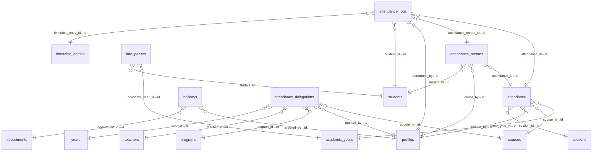

### Exams

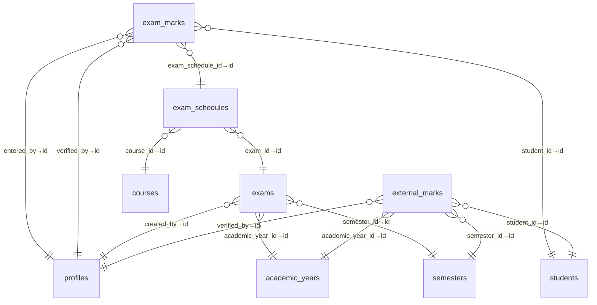

### Assignments

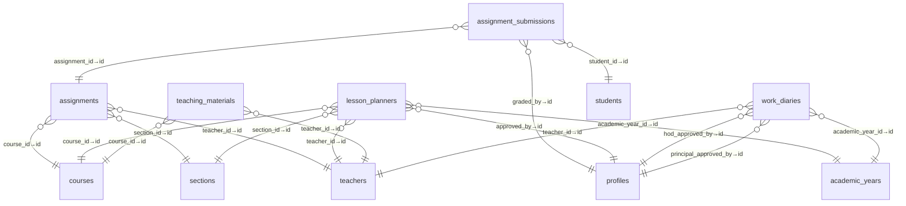

### Library

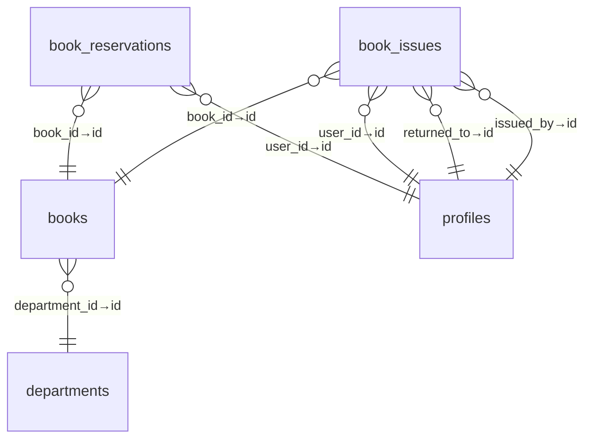

### Fees

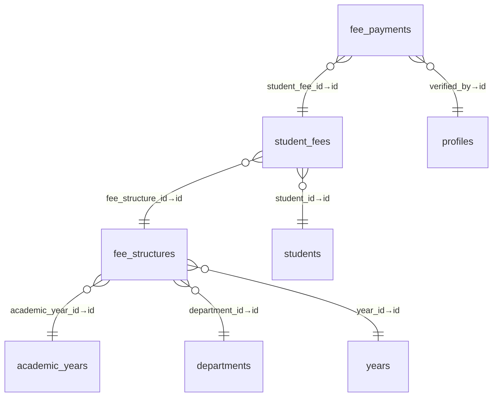

### Transport

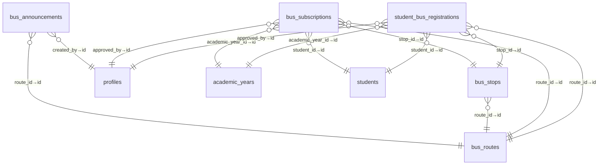

### Canteen

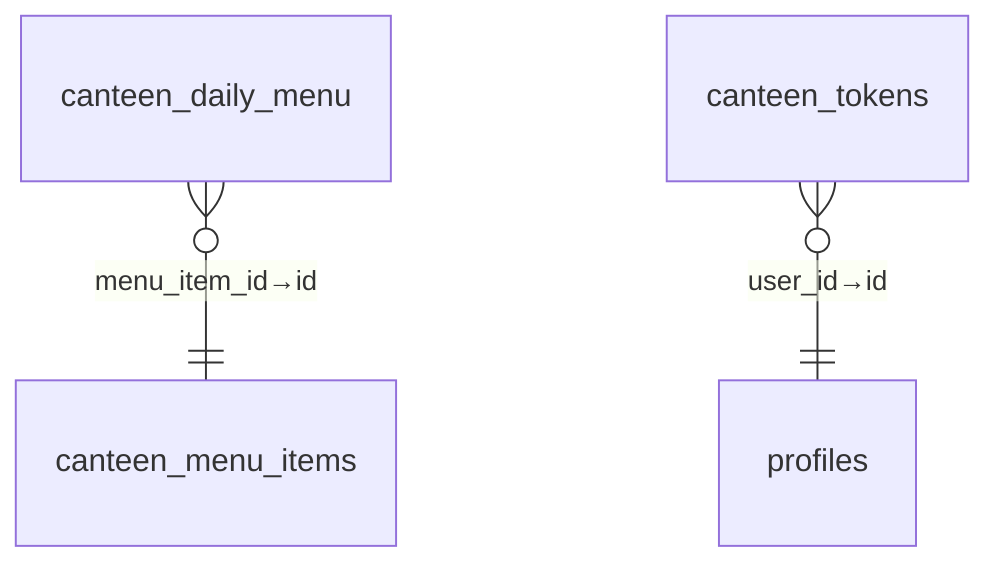

### Notices

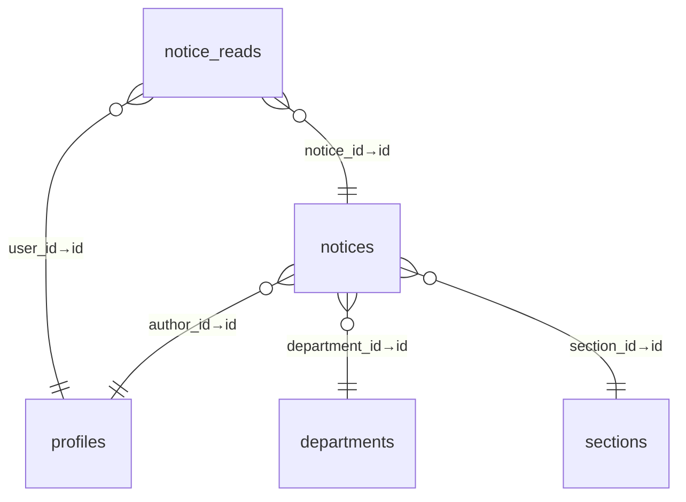

### Events

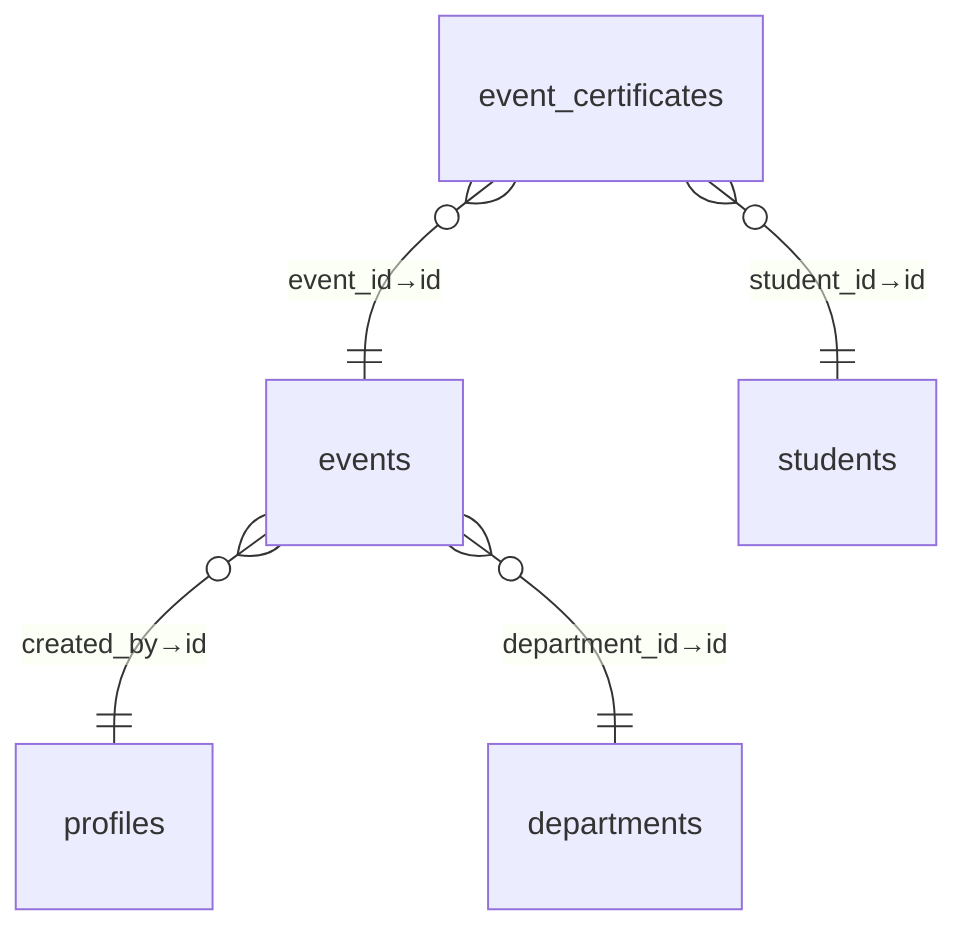

### Admin

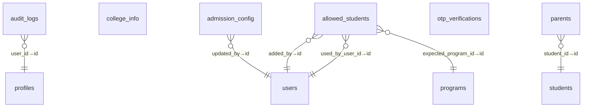
