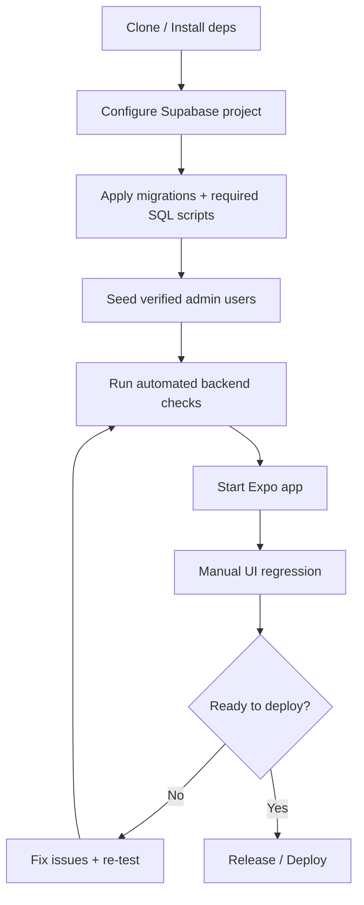
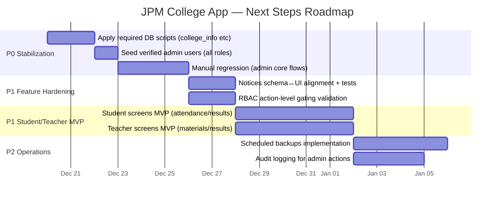

# JPM College App — Project Status & Next Steps

**Generated:** 2025-12-20  
**How this was derived:** This summary is based on the repo’s existing plan + completion reports + test reports (e.g., `PROJECT_PLAN.md`, `CODE_VERIFICATION_REPORT.md`, `BACKEND_TEST_REPORT.md`, `TEST_RESULTS_SUMMARY.md`, and the various `*_COMPLETE.md` / `*_SUMMARY.md` documents).

---

## 1) What’s done (evidence-based)

| Area | What’s completed | Evidence in repo | Notes |
|---|---|---|---|
| Database fixes | Missing tables/columns created (`batches`, `parents`, `bus_subscriptions`, `students.batch_id`), RLS+indexes+triggers | `DATABASE_FIXES_COMPLETE.md` | Fixes 10 verified schema mismatches from `DATABASE_ISSUES.md` |
| Admin module backend | Exams/Fees/Library/Assignments tables + functions implemented & tested (7/7) | `BACKEND_TEST_REPORT.md` | Includes library/fees/assignments analytics functions |
| Code verification | Previously broken admin pages compile and run clean | `CODE_VERIFICATION_REPORT.md` | Analytics + Library Issue/Reservations + Batches + Bus pages verified |
| RBAC core | RBAC library, hook, Restricted component, role dashboard, DB RBAC functions & seeds | `RBAC_IMPLEMENTATION.md` | Confirms roles/permissions/modules mapping |
| RBAC protection | 19 admin screens wrapped with `Restricted` permissions and dashboard actions filtered | `RBAC_PROTECTION_COMPLETE.md` | Notes manual test checklist for roles |
| Realtime analytics | Realtime subscriptions + analytics queries + live/static toggle + refresh | `REALTIME_ANALYTICS_BACKUP_FEATURES.md`, `TEST_RESULTS_SUMMARY.md` | Automated tests show success for subscriptions + analytics queries |
| Backup/restore | Quick backup, export/share, import/paste restore, backup list/delete, validation | `REALTIME_ANALYTICS_BACKUP_FEATURES.md`, `TEST_RESULTS_SUMMARY.md` | Scheduled backups explicitly “placeholder / not implemented” |
| College info | College info DB table + RLS + admin page (view/edit/validation) | `COLLEGE_INFO_PAGE_COMPLETE.md` | Requires applying SQL/migration to your Supabase if not already applied |
| Courses update | `courses` now supports both degree programs and subject courses via `is_degree_program` | `COURSES_UPDATE_SUMMARY.md`, `SETUP_INSTRUCTIONS.md` | Student creation filters degree programs only |
| Delete UX improvements | Delete operations confirmed, improved UI/alerts/loading states | `DELETE_FIX_SUMMARY.md` | Soft-delete pattern + realtime UI updates |
| Student/Teacher navbar | Bottom nav integrated for student/teacher layouts + placeholder target screens created | `NAVBAR_FIX_SUMMARY.md` | Placeholders exist; feature-complete screens likely still pending |
| Admin test users | 9 verified admin users + roles assignment script provided | `SETUP_INSTRUCTIONS.md`, `ADMIN_CREDENTIALS.md` | Use `scripts/create-verified-admin-users.sql` |

---

## 2) What still needs to be done (next steps)

These are the most practical next actions based on the plan’s “Next Steps”, plus known limitations explicitly called out in the feature docs.

| Priority | Next step | Why it matters | Prereqs | How to verify |
|---|---|---|---|---|
| P0 | Apply DB migrations/scripts that are marked “required” (especially `college_info`) | Avoid runtime errors / missing tables in production | Supabase access | Navigate to Admin → College Info; view + edit works for allowed roles |
| P0 | Seed verified admin users (all roles) in your target environment | Enables real RBAC testing across roles | Run `scripts/create-verified-admin-users.sql` | Login as each role; confirm only allowed modules show |
| P0 | End-to-end manual regression pass on key admin flows | Reports confirm compilation; this validates real UX workflows | Seed minimal data | Follow `MANUAL_TEST_CHECKLIST.md` and verify “no console errors” |
| P1 | Align any remaining schema↔UI mismatches (Notices called out in plan) | Prevents runtime query issues | Confirm schema fields | Create + view notices as principal/super_admin; verify counts in analytics |
| P1 | Add/confirm RBAC gating for *actions* (create/update/delete) across admin screens | Screen-level RBAC exists; action-level reduces privilege leaks | RBAC roles set | Attempt restricted actions as non-privileged role; should be blocked |
| P1 | Expand student/teacher placeholder screens into real modules (attendance/materials/results/profile) | Currently nav exists, but feature modules are likely incomplete | Define MVP per role | Student sees own attendance/results; teacher can post materials/marks |
| P2 | Implement scheduled backups (currently placeholder) | Removes manual operational burden | Choose approach (Expo background tasks) | Backups auto-create on schedule; files appear in saved list |
| P2 | Optional: compression/encryption for backups | Improves performance/security for large datasets | Decide strategy | Backup size reduced; restore still works |
| P2 | Audit logging for critical admin actions | Mentioned in plan; important for accountability | DB table + triggers | Perform actions; verify audit entries appear |
| P3 | Update project plan “Current Status” to match repo reality | Plan currently under-reports progress (e.g., admin modules exist) | None | `PROJECT_PLAN.md` status table reflects actual screens/modules |

---

## 3) Diagram — Setup & Verification Flow

---

## 4) Diagram — Short Roadmap (next 2–4 weeks)

---

## 5) Plan vs repo reality (important)

`PROJECT_PLAN.md` “Current Status” reports many areas as “Not Started”. However, the repo contains multiple “COMPLETE” and “ALL TESTS PASSED” reports indicating **significant progress already exists** (RBAC, admin modules, backup/restore, analytics, etc.).

Recommendation: treat `PROJECT_PLAN.md` as the *original roadmap*, and treat the various `*_COMPLETE.md` / `*_SUMMARY.md` reports as the *actual delivery record*. Updating the plan’s status section will reduce confusion for anyone joining the project.
