# College App Database Architecture

**Date:** 2026-01-13  
**Database:** PostgreSQL (Supabase)  
**Total Tables:** 40+  
**Security:** Row Level Security (RLS) Enabled

---

## Table of Contents

1. [Complete Database Schema Overview](#complete-database-schema-overview)
2. [Entity Relationship Diagram](#entity-relationship-diagram)
3. [Database Flow Architecture](#database-flow-architecture)
4. [Row Level Security (RLS) Overview](#row-level-security-rls-overview)
5. [RLS Policy Visualization](#rls-policy-visualization)
6. [Data Flow Diagrams](#data-flow-diagrams)
7. [Table Relationships](#table-relationships)
8. [Security Functions](#security-functions)

---

## Complete Database Schema Overview

### Database Architecture at a Glance


```mermaid
graph TB
    subgraph "Authentication Layer"
        AUTH[Supabase Auth]
        PROFILES[profiles table]
        AUTH --> PROFILES
    end
    
    subgraph "Authorization Layer"
        ROLES[roles table]
        USER_ROLES[user_roles table]
        RBAC[RBAC Functions]
        PROFILES --> USER_ROLES
        ROLES --> USER_ROLES
        USER_ROLES --> RBAC
    end
    
    subgraph "Core Academic"
        DEPTS[departments]
        YEARS[years]
        SEMS[semesters]
        SECTIONS[sections]
        COURSES[courses]
        ACAD_YEARS[academic_years]
        
        DEPTS --> SECTIONS
        YEARS --> SEMS
        YEARS --> SECTIONS
        SEMS --> COURSES
        DEPTS --> COURSES
    end
    
    subgraph "User Management"
        STUDENTS[students]
        TEACHERS[teachers]
        MENTOR[mentor_assignments]
        TEACHER_COURSES[teacher_courses]
        
        PROFILES --> STUDENTS
        PROFILES --> TEACHERS
        STUDENTS --> SECTIONS
        TEACHERS --> DEPTS
        TEACHERS --> MENTOR
        STUDENTS --> MENTOR
        TEACHERS --> TEACHER_COURSES
        COURSES --> TEACHER_COURSES
    end
    
    subgraph "Timetable & Attendance"
        TIMETABLE[timetable_entries]
        ATTENDANCE[attendance]
        ATT_RECORDS[attendance_records]
        ATT_ALERTS[attendance_alerts]
        SUBSTITUTIONS[substitutions]
        LATE_PASSES[late_passes]
        HOLIDAYS[holidays]
        LEAVES[student_leave_applications]
        
        TEACHER_COURSES --> TIMETABLE
        TIMETABLE --> ATTENDANCE
        ATTENDANCE --> ATT_RECORDS
        STUDENTS --> ATT_RECORDS
        STUDENTS --> ATT_ALERTS
        TIMETABLE --> SUBSTITUTIONS
        STUDENTS --> LATE_PASSES
        STUDENTS --> LEAVES
    end
    
    subgraph "Examination System"
        EXAMS[exams]
        EXAM_SCHEDULES[exam_schedules]
        EXAM_MARKS[exam_marks]
        EXTERNAL_MARKS[external_marks]
        
        EXAMS --> EXAM_SCHEDULES
        COURSES --> EXAM_SCHEDULES
        EXAM_SCHEDULES --> EXAM_MARKS
        STUDENTS --> EXAM_MARKS
        STUDENTS --> EXTERNAL_MARKS
    end
    
    subgraph "Assignments & Materials"
        ASSIGNMENTS[assignments]
        SUBMISSIONS[assignment_submissions]
        MATERIALS[teaching_materials]
        
        TEACHERS --> ASSIGNMENTS
        COURSES --> ASSIGNMENTS
        ASSIGNMENTS --> SUBMISSIONS
        STUDENTS --> SUBMISSIONS
        TEACHERS --> MATERIALS
        COURSES --> MATERIALS
    end
    
    subgraph "Library System"
        BOOKS[books]
        BOOK_ISSUES[book_issues]
        BOOK_RESERVATIONS[book_reservations]
        
        BOOKS --> BOOK_ISSUES
        BOOKS --> BOOK_RESERVATIONS
        STUDENTS --> BOOK_ISSUES
        STUDENTS --> BOOK_RESERVATIONS
    end
    
    subgraph "Financial System"
        FEE_STRUCTURES[fee_structures]
        STUDENT_FEES[student_fees]
        FEE_PAYMENTS[fee_payments]
        
        FEE_STRUCTURES --> STUDENT_FEES
        STUDENTS --> STUDENT_FEES
        STUDENT_FEES --> FEE_PAYMENTS
    end
    
    subgraph "Transport System"
        BUS_ROUTES[bus_routes]
        BUS_STOPS[bus_stops]
        BUS_VEHICLES[bus_vehicles]
        BUS_SUBS[bus_subscriptions]
        BUS_ALERTS[bus_alerts]
        
        BUS_ROUTES --> BUS_STOPS
        BUS_ROUTES --> BUS_VEHICLES
        BUS_ROUTES --> BUS_SUBS
        STUDENTS --> BUS_SUBS
        BUS_VEHICLES --> BUS_ALERTS
    end
    
    subgraph "Canteen System"
        MENU_ITEMS[canteen_menu_items]
        DAILY_MENU[canteen_daily_menu]
        TOKENS[canteen_tokens]
        
        MENU_ITEMS --> DAILY_MENU
        DAILY_MENU --> TOKENS
        STUDENTS --> TOKENS
    end
    
    subgraph "Communication"
        NOTICES[notices]
        NOTICE_READS[notice_reads]
        EVENTS[events]
        EVENT_CERTS[event_certificates]
        FEEDBACK[feedback]
        COMPLAINTS[complaints]
        
        NOTICES --> NOTICE_READS
        PROFILES --> NOTICE_READS
        EVENTS --> EVENT_CERTS
        STUDENTS --> EVENT_CERTS
        PROFILES --> FEEDBACK
        PROFILES --> COMPLAINTS
    end
    
    subgraph "Teacher Workflows"
        LESSON_PLANNERS[lesson_planners]
        WORK_DIARY[work_diary_entries]
        
        TEACHERS --> LESSON_PLANNERS
        COURSES --> LESSON_PLANNERS
        TEACHERS --> WORK_DIARY
        COURSES --> WORK_DIARY
    end
    
    subgraph "Reception"
        GATE_PASSES[gate_passes]
        
        STUDENTS --> GATE_PASSES
    end
    
    subgraph "Miscellaneous"
        MINOR_SUBJECTS[minor_subjects]
        STUDENT_MINORS[student_minor_registrations]
        COLLEGE_INFO[college_info]
        
        MINOR_SUBJECTS --> STUDENT_MINORS
        STUDENTS --> STUDENT_MINORS
    end
    
    subgraph "Storage Buckets"
        BUCKET_MATERIALS[teaching-materials]
        BUCKET_SUBMISSIONS[assignment-submissions]
        BUCKET_PROFILES[profile-photos]
        BUCKET_DOCS[documents]
    end
    
    MATERIALS -.-> BUCKET_MATERIALS
    SUBMISSIONS -.-> BUCKET_SUBMISSIONS
    PROFILES -.-> BUCKET_PROFILES
    
    style AUTH fill:#4CAF50
    style PROFILES fill:#4CAF50
    style RBAC fill:#2196F3
    style ROLES fill:#FF9800
    style USER_ROLES fill:#FF9800
```

### Table Categories

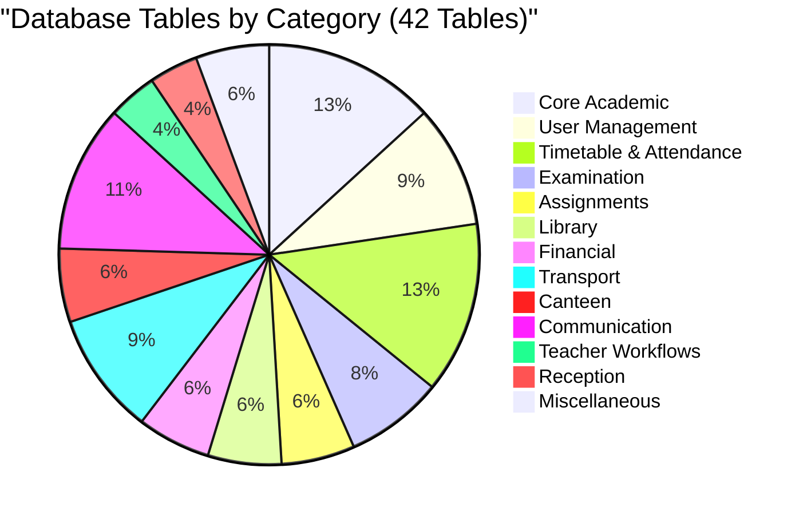
```mermaid
pie title "Database Tables by Category (42 Tables)"
    "Core Academic" : 7
    "User Management" : 5
    "Timetable & Attendance" : 7
    "Examination" : 4
    "Assignments" : 3
    "Library" : 3
    "Financial" : 3
    "Transport" : 5
    "Canteen" : 3
    "Communication" : 6
    "Teacher Workflows" : 2
    "Reception" : 2
    "Miscellaneous" : 3
```

---

## Entity Relationship Diagram

### Core Academic Structure


```mermaid
erDiagram
    %% Core Tables
    PROFILES ||--o{ USER_ROLES : has
    PROFILES ||--o| STUDENTS : "is a"
    PROFILES ||--o| TEACHERS : "is a"
    
    ROLES ||--o{ USER_ROLES : assigned
    DEPARTMENTS ||--o{ USER_ROLES : "scoped to"
    
    %% Academic Structure
    DEPARTMENTS ||--o{ COURSES : offers
    DEPARTMENTS ||--o{ STUDENTS : enrolled
    DEPARTMENTS ||--o{ TEACHERS : works_in
    DEPARTMENTS ||--o| TEACHERS : "has HOD"
    
    YEARS ||--o{ SEMESTERS : contains
    SEMESTERS ||--o{ COURSES : "taught in"
    
    YEARS ||--o{ SECTIONS : "has year level"
    DEPARTMENTS ||--o{ SECTIONS : "owns section"
    SECTIONS ||--o{ STUDENTS : "assigned to"
    SECTIONS ||--o| TEACHERS : "has class teacher"
    
    %% Academic Year
    ACADEMIC_YEARS ||--o{ STUDENTS : "enrolled in"
    ACADEMIC_YEARS ||--o{ EXAMS : "conducted in"
    ACADEMIC_YEARS ||--o{ EXTERNAL_MARKS : "results for"
    
    %% Teaching
    TEACHERS ||--o{ TEACHER_COURSES : teaches
    COURSES ||--o{ TEACHER_COURSES : "taught by"
    SECTIONS ||--o{ TEACHER_COURSES : "assigned to"
    
    TEACHERS ||--o{ MENTOR_ASSIGNMENTS : mentors
    STUDENTS ||--o{ MENTOR_ASSIGNMENTS : "mentored by"

    %% Entity Definitions
    PROFILES {
        uuid id PK
        string email UK
        string full_name
        string phone
        enum primary_role
        enum status
        timestamp created_at
    }
    
    USER_ROLES {
        uuid id PK
        uuid user_id FK
        uuid role_id FK
        uuid department_id FK
        boolean is_active
    }
    
    ROLES {
        uuid id PK
        string name UK
        string display_name
        enum category
        jsonb permissions
    }
    
    DEPARTMENTS {
        uuid id PK
        string code UK
        string name
        uuid hod_user_id FK
    }
    
    STUDENTS {
        uuid id PK
        uuid user_id FK
        string registration_number UK
        string roll_number
        uuid department_id FK
        uuid section_id FK
        uuid academic_year_id FK
    }
    
    TEACHERS {
        uuid id PK
        uuid user_id FK
        string employee_id UK
        uuid department_id FK
        enum designation
        enum teacher_type
    }
    
    YEARS {
        uuid id PK
        int year_number
        string name
    }
    
    SEMESTERS {
        uuid id PK
        int semester_number
        uuid year_id FK
    }
    
    SECTIONS {
        uuid id PK
        string name
        uuid department_id FK
        uuid year_id FK
        uuid class_teacher_id FK
    }
    
    COURSES {
        uuid id PK
        string code UK
        string name
        uuid department_id FK
        uuid semester_id FK
        enum course_type
        int credits
    }
    
    ACADEMIC_YEARS {
        uuid id PK
        string name
        date start_date
        date end_date
        boolean is_current
    }
```

### Timetable & Attendance Module

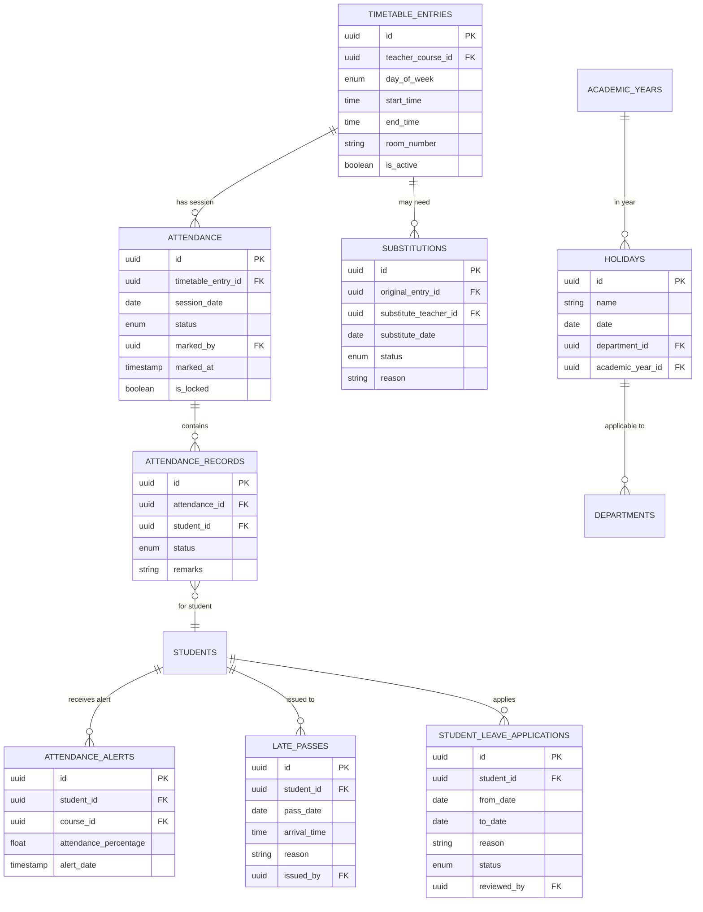
```mermaid
erDiagram
    TIMETABLE_ENTRIES ||--o{ ATTENDANCE : "has session"
    TIMETABLE_ENTRIES ||--o{ SUBSTITUTIONS : "may need"
    
    ATTENDANCE ||--o{ ATTENDANCE_RECORDS : contains
    ATTENDANCE_RECORDS }o--|| STUDENTS : "for student"
    
    STUDENTS ||--o{ ATTENDANCE_ALERTS : "receives alert"
    STUDENTS ||--o{ LATE_PASSES : "issued to"
    STUDENTS ||--o{ STUDENT_LEAVE_APPLICATIONS : applies
    
    HOLIDAYS ||--o{ DEPARTMENTS : "applicable to"
    ACADEMIC_YEARS ||--o{ HOLIDAYS : "in year"

    TIMETABLE_ENTRIES {
        uuid id PK
        uuid teacher_course_id FK
        enum day_of_week
        time start_time
        time end_time
        string room_number
        boolean is_active
    }
    
    ATTENDANCE {
        uuid id PK
        uuid timetable_entry_id FK
        date session_date
        enum status
        uuid marked_by FK
        timestamp marked_at
        boolean is_locked
    }
    
    ATTENDANCE_RECORDS {
        uuid id PK
        uuid attendance_id FK
        uuid student_id FK
        enum status
        string remarks
    }
    
    SUBSTITUTIONS {
        uuid id PK
        uuid original_entry_id FK
        uuid substitute_teacher_id FK
        date substitute_date
        enum status
        string reason
    }
    
    ATTENDANCE_ALERTS {
        uuid id PK
        uuid student_id FK
        uuid course_id FK
        float attendance_percentage
        timestamp alert_date
    }
    
    LATE_PASSES {
        uuid id PK
        uuid student_id FK
        date pass_date
        time arrival_time
        string reason
        uuid issued_by FK
    }
    
    STUDENT_LEAVE_APPLICATIONS {
        uuid id PK
        uuid student_id FK
        date from_date
        date to_date
        string reason
        enum status
        uuid reviewed_by FK
    }
    
    HOLIDAYS {
        uuid id PK
        string name
        date date
        uuid department_id FK
        uuid academic_year_id FK
    }
```

### Examination Module

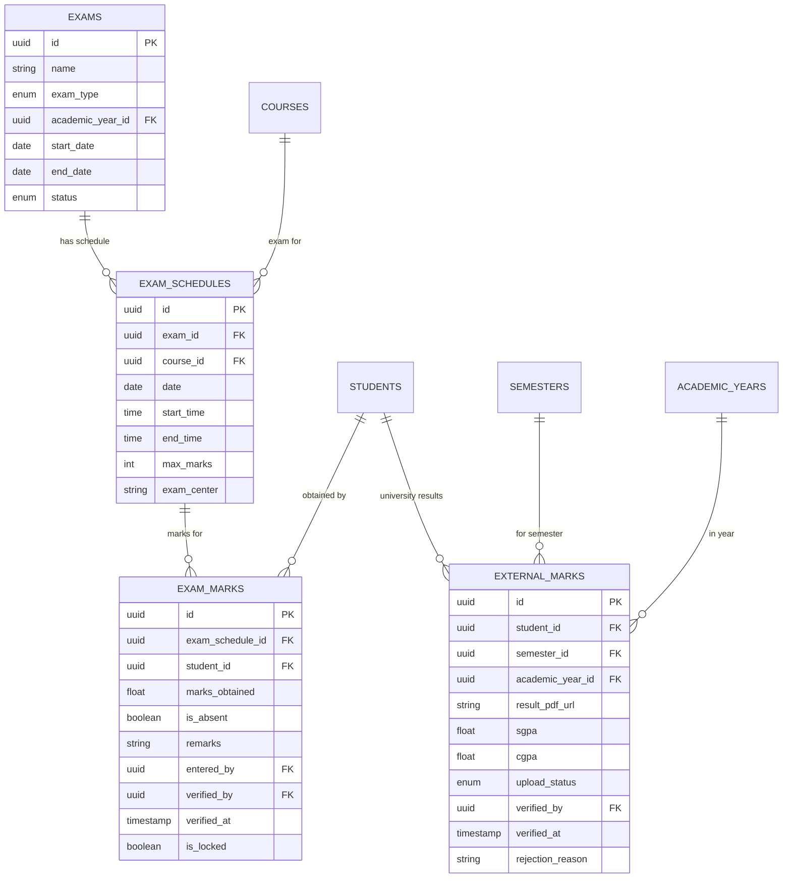
```mermaid
erDiagram
    EXAMS ||--o{ EXAM_SCHEDULES : "has schedule"
    EXAM_SCHEDULES ||--o{ EXAM_MARKS : "marks for"
    
    COURSES ||--o{ EXAM_SCHEDULES : "exam for"
    STUDENTS ||--o{ EXAM_MARKS : "obtained by"
    
    STUDENTS ||--o{ EXTERNAL_MARKS : "university results"
    SEMESTERS ||--o{ EXTERNAL_MARKS : "for semester"
    ACADEMIC_YEARS ||--o{ EXTERNAL_MARKS : "in year"

    EXAMS {
        uuid id PK
        string name
        enum exam_type
        uuid academic_year_id FK
        date start_date
        date end_date
        enum status
    }
    
    EXAM_SCHEDULES {
        uuid id PK
        uuid exam_id FK
        uuid course_id FK
        date date
        time start_time
        time end_time
        int max_marks
        string exam_center
    }
    
    EXAM_MARKS {
        uuid id PK
        uuid exam_schedule_id FK
        uuid student_id FK
        float marks_obtained
        boolean is_absent
        string remarks
        uuid entered_by FK
        uuid verified_by FK
        timestamp verified_at
        boolean is_locked
    }
    
    EXTERNAL_MARKS {
        uuid id PK
        uuid student_id FK
        uuid semester_id FK
        uuid academic_year_id FK
        string result_pdf_url
        float sgpa
        float cgpa
        enum upload_status
        uuid verified_by FK
        timestamp verified_at
        string rejection_reason
    }
```

### Assignments Module

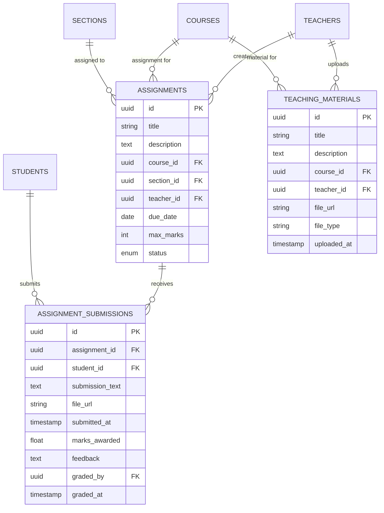
```mermaid
erDiagram
    TEACHERS ||--o{ ASSIGNMENTS : creates
    COURSES ||--o{ ASSIGNMENTS : "assignment for"
    SECTIONS ||--o{ ASSIGNMENTS : "assigned to"
    
    ASSIGNMENTS ||--o{ ASSIGNMENT_SUBMISSIONS : receives
    STUDENTS ||--o{ ASSIGNMENT_SUBMISSIONS : submits
    
    TEACHERS ||--o{ TEACHING_MATERIALS : uploads
    COURSES ||--o{ TEACHING_MATERIALS : "material for"

    ASSIGNMENTS {
        uuid id PK
        string title
        text description
        uuid course_id FK
        uuid section_id FK
        uuid teacher_id FK
        date due_date
        int max_marks
        enum status
    }
    
    ASSIGNMENT_SUBMISSIONS {
        uuid id PK
        uuid assignment_id FK
        uuid student_id FK
        text submission_text
        string file_url
        timestamp submitted_at
        float marks_awarded
        text feedback
        uuid graded_by FK
        timestamp graded_at
    }
    
    TEACHING_MATERIALS {
        uuid id PK
        string title
        text description
        uuid course_id FK
        uuid teacher_id FK
        string file_url
        string file_type
        timestamp uploaded_at
    }
```

### Library Module

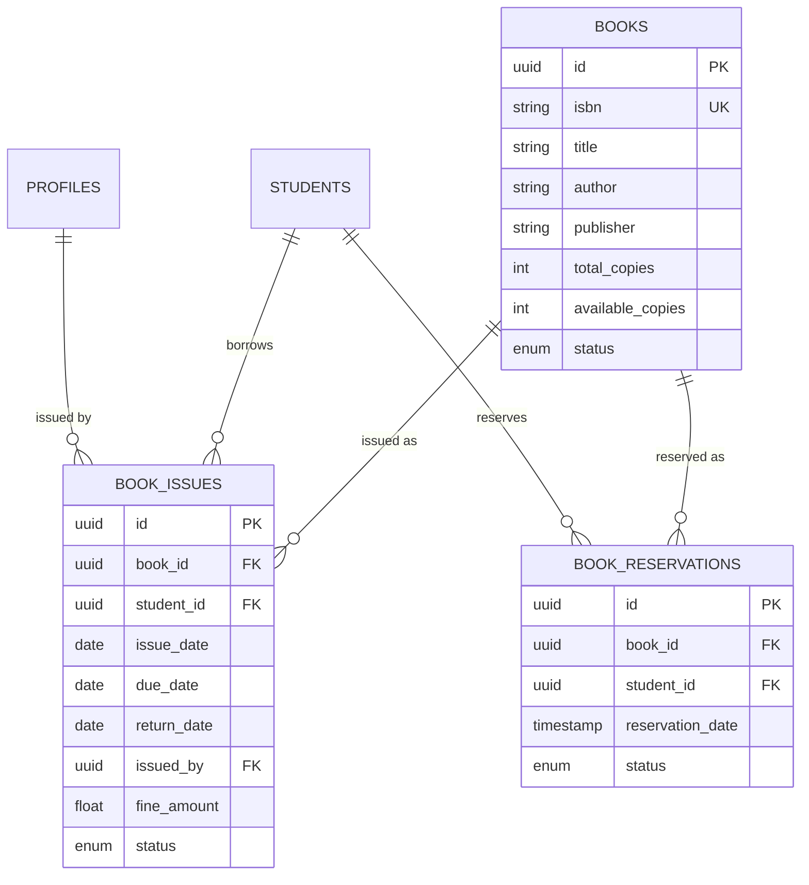
```mermaid
erDiagram
    BOOKS ||--o{ BOOK_ISSUES : "issued as"
    BOOKS ||--o{ BOOK_RESERVATIONS : "reserved as"
    
    STUDENTS ||--o{ BOOK_ISSUES : borrows
    STUDENTS ||--o{ BOOK_RESERVATIONS : reserves
    
    PROFILES ||--o{ BOOK_ISSUES : "issued by"

    BOOKS {
        uuid id PK
        string isbn UK
        string title
        string author
        string publisher
        int total_copies
        int available_copies
        enum status
    }
    
    BOOK_ISSUES {
        uuid id PK
        uuid book_id FK
        uuid student_id FK
        date issue_date
        date due_date
        date return_date
        uuid issued_by FK
        float fine_amount
        enum status
    }
    
    BOOK_RESERVATIONS {
        uuid id PK
        uuid book_id FK
        uuid student_id FK
        timestamp reservation_date
        enum status
    }
```

### Fees Module

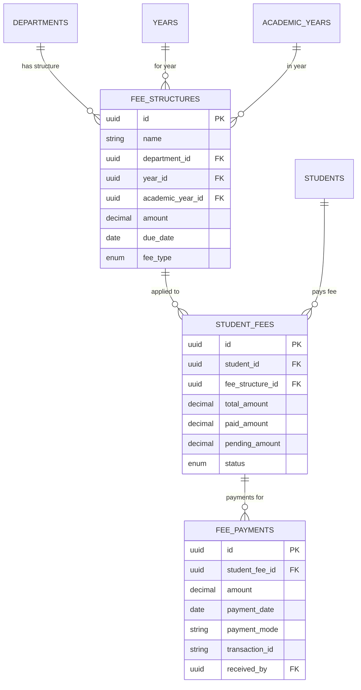
```mermaid
erDiagram
    DEPARTMENTS ||--o{ FEE_STRUCTURES : "has structure"
    YEARS ||--o{ FEE_STRUCTURES : "for year"
    ACADEMIC_YEARS ||--o{ FEE_STRUCTURES : "in year"
    
    FEE_STRUCTURES ||--o{ STUDENT_FEES : "applied to"
    STUDENTS ||--o{ STUDENT_FEES : "pays fee"
    
    STUDENT_FEES ||--o{ FEE_PAYMENTS : "payments for"

    FEE_STRUCTURES {
        uuid id PK
        string name
        uuid department_id FK
        uuid year_id FK
        uuid academic_year_id FK
        decimal amount
        date due_date
        enum fee_type
    }
    
    STUDENT_FEES {
        uuid id PK
        uuid student_id FK
        uuid fee_structure_id FK
        decimal total_amount
        decimal paid_amount
        decimal pending_amount
        enum status
    }
    
    FEE_PAYMENTS {
        uuid id PK
        uuid student_fee_id FK
        decimal amount
        date payment_date
        string payment_mode
        string transaction_id
        uuid received_by FK
    }
```

### Bus Transport Module

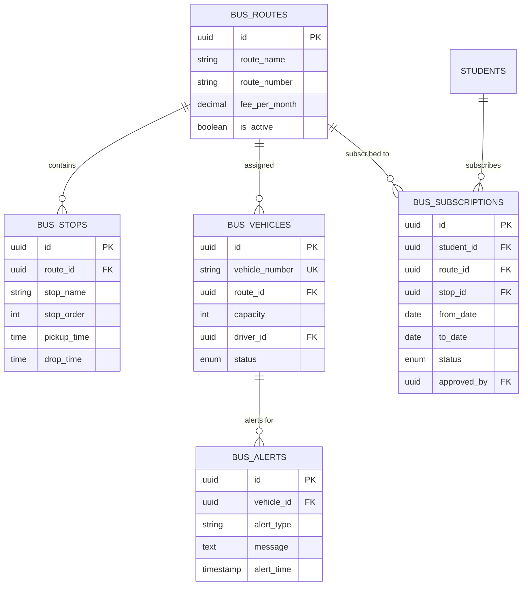
```mermaid
erDiagram
    BUS_ROUTES ||--o{ BUS_STOPS : contains
    BUS_ROUTES ||--o{ BUS_VEHICLES : assigned
    BUS_ROUTES ||--o{ BUS_SUBSCRIPTIONS : "subscribed to"
    
    STUDENTS ||--o{ BUS_SUBSCRIPTIONS : subscribes
    BUS_VEHICLES ||--o{ BUS_ALERTS : "alerts for"

    BUS_ROUTES {
        uuid id PK
        string route_name
        string route_number
        decimal fee_per_month
        boolean is_active
    }
    
    BUS_STOPS {
        uuid id PK
        uuid route_id FK
        string stop_name
        int stop_order
        time pickup_time
        time drop_time
    }
    
    BUS_VEHICLES {
        uuid id PK
        string vehicle_number UK
        uuid route_id FK
        int capacity
        uuid driver_id FK
        enum status
    }
    
    BUS_SUBSCRIPTIONS {
        uuid id PK
        uuid student_id FK
        uuid route_id FK
        uuid stop_id FK
        date from_date
        date to_date
        enum status
        uuid approved_by FK
    }
    
    BUS_ALERTS {
        uuid id PK
        uuid vehicle_id FK
        string alert_type
        text message
        timestamp alert_time
    }
```

### Canteen Module

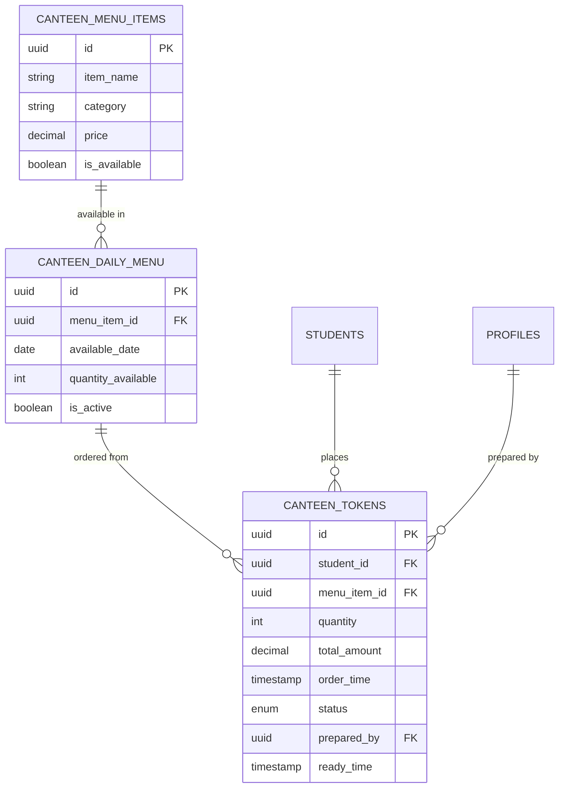
```mermaid
erDiagram
    CANTEEN_MENU_ITEMS ||--o{ CANTEEN_DAILY_MENU : "available in"
    CANTEEN_DAILY_MENU ||--o{ CANTEEN_TOKENS : "ordered from"
    
    STUDENTS ||--o{ CANTEEN_TOKENS : places
    PROFILES ||--o{ CANTEEN_TOKENS : "prepared by"

    CANTEEN_MENU_ITEMS {
        uuid id PK
        string item_name
        string category
        decimal price
        boolean is_available
    }
    
    CANTEEN_DAILY_MENU {
        uuid id PK
        uuid menu_item_id FK
        date available_date
        int quantity_available
        boolean is_active
    }
    
    CANTEEN_TOKENS {
        uuid id PK
        uuid student_id FK
        uuid menu_item_id FK
        int quantity
        decimal total_amount
        timestamp order_time
        enum status
        uuid prepared_by FK
        timestamp ready_time
    }
```

### Communication Module

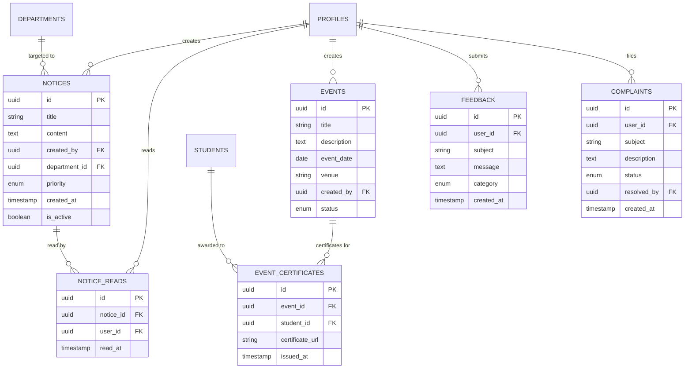
```mermaid
erDiagram
    PROFILES ||--o{ NOTICES : creates
    DEPARTMENTS ||--o{ NOTICES : "targeted to"
    NOTICES ||--o{ NOTICE_READS : "read by"
    PROFILES ||--o{ NOTICE_READS : reads
    
    PROFILES ||--o{ EVENTS : creates
    EVENTS ||--o{ EVENT_CERTIFICATES : "certificates for"
    STUDENTS ||--o{ EVENT_CERTIFICATES : "awarded to"
    
    PROFILES ||--o{ FEEDBACK : submits
    PROFILES ||--o{ COMPLAINTS : files

    NOTICES {
        uuid id PK
        string title
        text content
        uuid created_by FK
        uuid department_id FK
        enum priority
        timestamp created_at
        boolean is_active
    }
    
    NOTICE_READS {
        uuid id PK
        uuid notice_id FK
        uuid user_id FK
        timestamp read_at
    }
    
    EVENTS {
        uuid id PK
        string title
        text description
        date event_date
        string venue
        uuid created_by FK
        enum status
    }
    
    EVENT_CERTIFICATES {
        uuid id PK
        uuid event_id FK
        uuid student_id FK
        string certificate_url
        timestamp issued_at
    }
    
    FEEDBACK {
        uuid id PK
        uuid user_id FK
        string subject
        text message
        enum category
        timestamp created_at
    }
    
    COMPLAINTS {
        uuid id PK
        uuid user_id FK
        string subject
        text description
        enum status
        uuid resolved_by FK
        timestamp created_at
    }
```

### Teacher Workflow Module

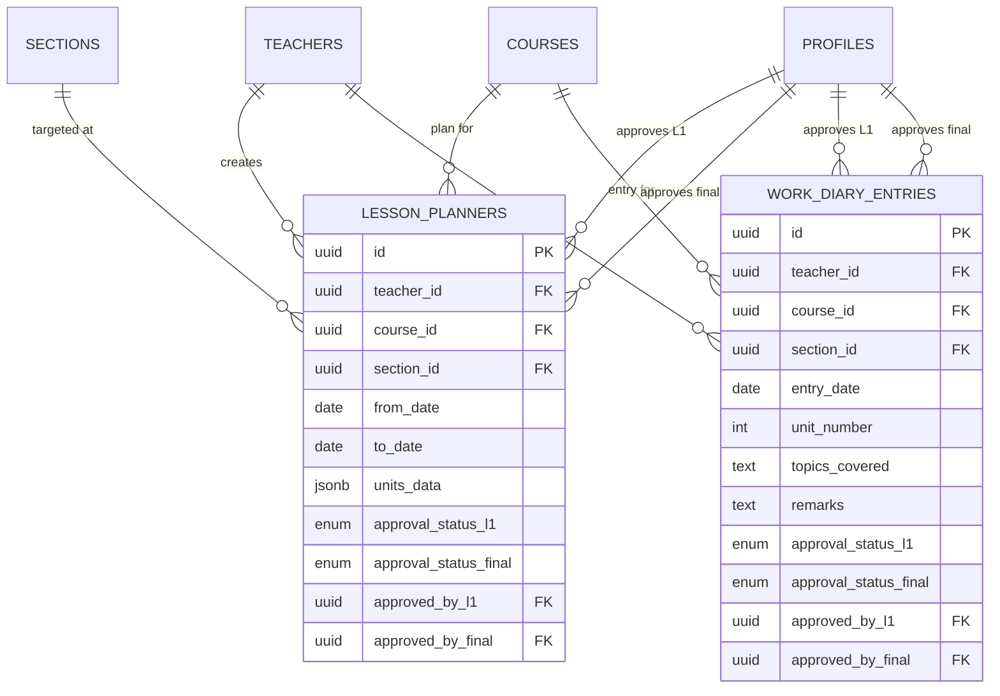
```mermaid
erDiagram
    TEACHERS ||--o{ LESSON_PLANNERS : creates
    COURSES ||--o{ LESSON_PLANNERS : "plan for"
    SECTIONS ||--o{ LESSON_PLANNERS : "targeted at"
    
    TEACHERS ||--o{ WORK_DIARY_ENTRIES : writes
    COURSES ||--o{ WORK_DIARY_ENTRIES : "entry for"
    
    PROFILES ||--o{ LESSON_PLANNERS : "approves L1"
    PROFILES ||--o{ LESSON_PLANNERS : "approves final"
    PROFILES ||--o{ WORK_DIARY_ENTRIES : "approves L1"
    PROFILES ||--o{ WORK_DIARY_ENTRIES : "approves final"

    LESSON_PLANNERS {
        uuid id PK
        uuid teacher_id FK
        uuid course_id FK
        uuid section_id FK
        date from_date
        date to_date
        jsonb units_data
        enum approval_status_l1
        enum approval_status_final
        uuid approved_by_l1 FK
        uuid approved_by_final FK
    }
    
    WORK_DIARY_ENTRIES {
        uuid id PK
        uuid teacher_id FK
        uuid course_id FK
        uuid section_id FK
        date entry_date
        int unit_number
        text topics_covered
        text remarks
        enum approval_status_l1
        enum approval_status_final
        uuid approved_by_l1 FK
        uuid approved_by_final FK
    }
```

### Reception Module

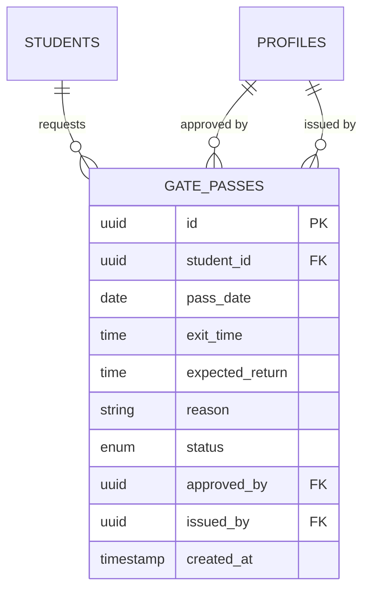
```mermaid
erDiagram
    STUDENTS ||--o{ GATE_PASSES : requests
    PROFILES ||--o{ GATE_PASSES : "approved by"
    PROFILES ||--o{ GATE_PASSES : "issued by"

    GATE_PASSES {
        uuid id PK
        uuid student_id FK
        date pass_date
        time exit_time
        time expected_return
        string reason
        enum status
        uuid approved_by FK
        uuid issued_by FK
        timestamp created_at
    }
```

### Miscellaneous

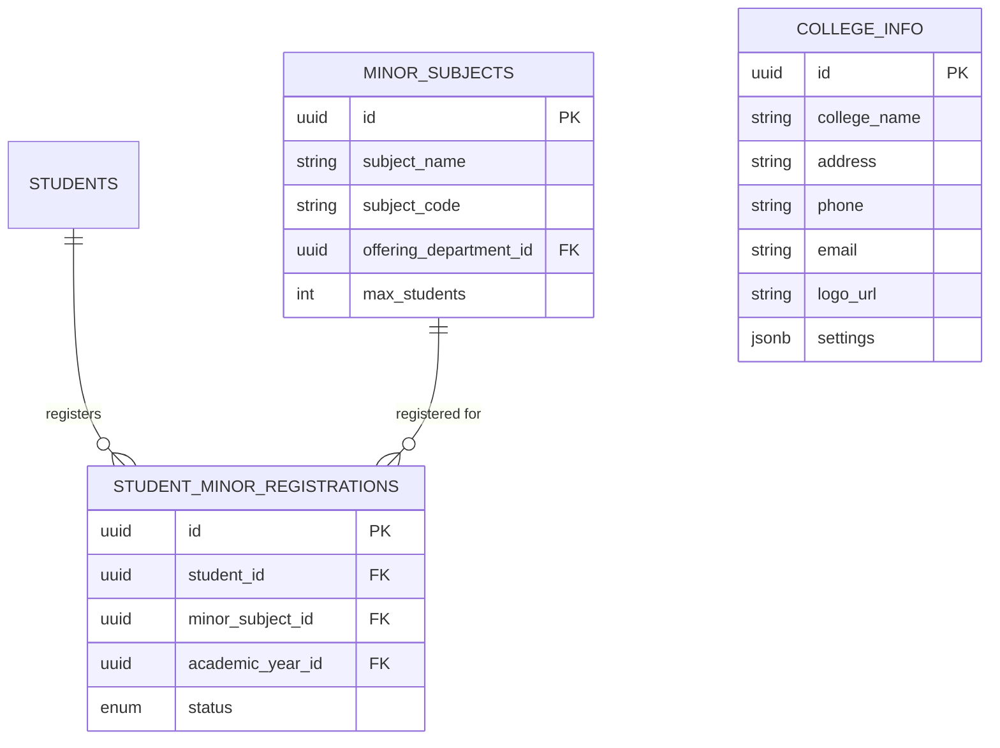
```mermaid
erDiagram
    STUDENTS ||--o{ STUDENT_MINOR_REGISTRATIONS : registers
    MINOR_SUBJECTS ||--o{ STUDENT_MINOR_REGISTRATIONS : "registered for"
    
    COLLEGE_INFO {
        uuid id PK
        string college_name
        string address
        string phone
        string email
        string logo_url
        jsonb settings
    }
    
    MINOR_SUBJECTS {
        uuid id PK
        string subject_name
        string subject_code
        uuid offering_department_id FK
        int max_students
    }
    
    STUDENT_MINOR_REGISTRATIONS {
        uuid id PK
        uuid student_id FK
        uuid minor_subject_id FK
        uuid academic_year_id FK
        enum status
    }
```

---

## Database Flow Architecture

### Authentication & Authorization Flow

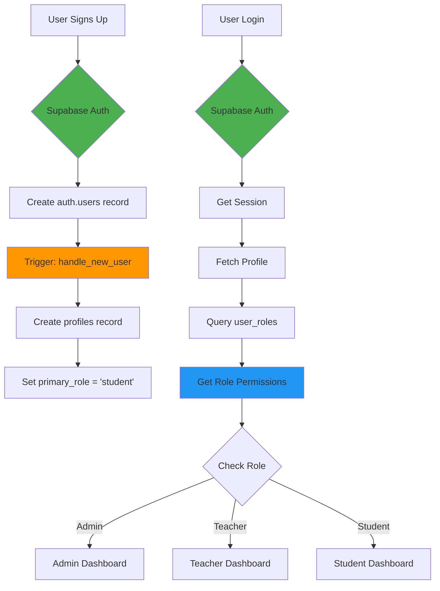
```mermaid
flowchart TD
    A[User Signs Up] --> B{Supabase Auth}
    B --> C[Create auth.users record]
    C --> D[Trigger: handle_new_user]
    D --> E[Create profiles record]
    E --> F[Set primary_role = 'student']
    
    G[User Login] --> H{Supabase Auth}
    H --> I[Get Session]
    I --> J[Fetch Profile]
    J --> K[Query user_roles]
    K --> L[Get Role Permissions]
    L --> M{Check Role}
    M -->|Admin| N[Admin Dashboard]
    M -->|Teacher| O[Teacher Dashboard]
    M -->|Student| P[Student Dashboard]
    
    style B fill:#4CAF50
    style H fill:#4CAF50
    style D fill:#FF9800
    style L fill:#2196F3
```

### Data Access with RLS

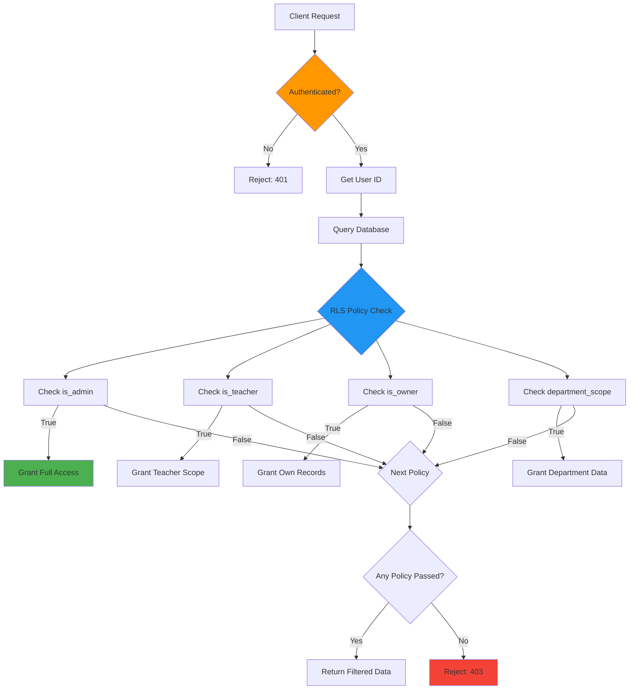
```mermaid
flowchart TD
    A[Client Request] --> B{Authenticated?}
    B -->|No| C[Reject: 401]
    B -->|Yes| D[Get User ID]
    D --> E[Query Database]
    E --> F{RLS Policy Check}
    
    F --> G[Check is_admin]
    F --> H[Check is_teacher]
    F --> I[Check is_owner]
    F --> J[Check department_scope]
    
    G -->|True| K[Grant Full Access]
    H -->|True| L[Grant Teacher Scope]
    I -->|True| M[Grant Own Records]
    J -->|True| N[Grant Department Data]
    
    G -->|False| O{Next Policy}
    H -->|False| O
    I -->|False| O
    J -->|False| O
    
    O --> P{Any Policy Passed?}
    P -->|Yes| Q[Return Filtered Data]
    P -->|No| R[Reject: 403]
    
    style B fill:#FF9800
    style F fill:#2196F3
    style K fill:#4CAF50
    style R fill:#F44336
```

### Student Data Access Flow

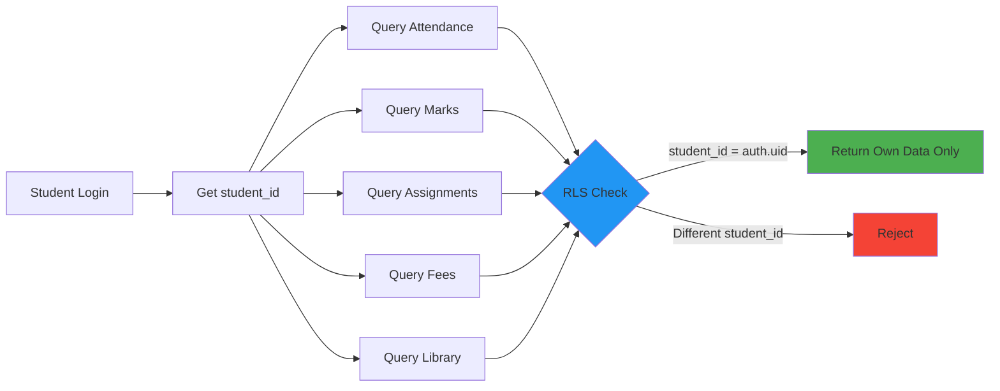
```mermaid
flowchart LR
    A[Student Login] --> B[Get student_id]
    B --> C[Query Attendance]
    B --> D[Query Marks]
    B --> E[Query Assignments]
    B --> F[Query Fees]
    B --> G[Query Library]
    
    C --> H{RLS Check}
    D --> H
    E --> H
    F --> H
    G --> H
    
    H -->|student_id = auth.uid| I[Return Own Data Only]
    H -->|Different student_id| J[Reject]
    
    style H fill:#2196F3
    style I fill:#4CAF50
    style J fill:#F44336
```

### Admin Data Management Flow

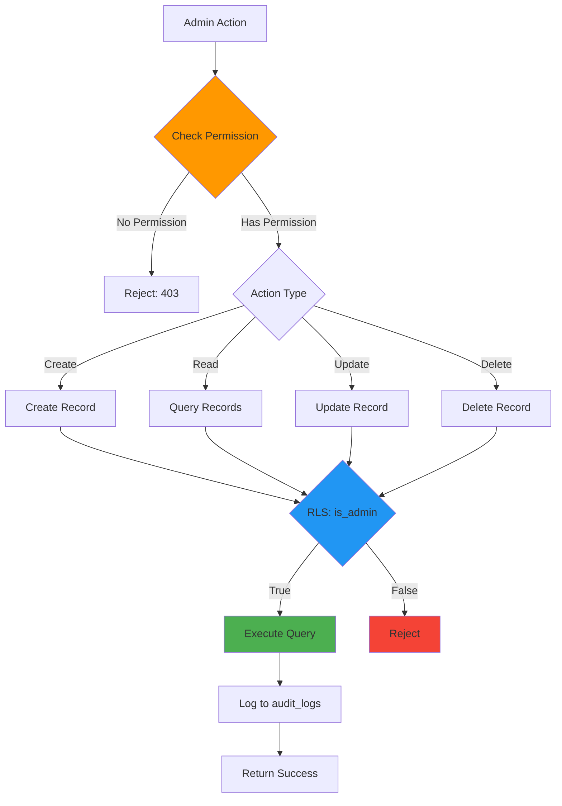
```mermaid
flowchart TD
    A[Admin Action] --> B{Check Permission}
    B -->|No Permission| C[Reject: 403]
    B -->|Has Permission| D{Action Type}
    
    D -->|Create| E[Create Record]
    D -->|Read| F[Query Records]
    D -->|Update| G[Update Record]
    D -->|Delete| H[Delete Record]
    
    E --> I{RLS: is_admin}
    F --> I
    G --> I
    H --> I
    
    I -->|True| J[Execute Query]
    I -->|False| K[Reject]
    
    J --> L[Log to audit_logs]
    L --> M[Return Success]
    
    style B fill:#FF9800
    style I fill:#2196F3
    style J fill:#4CAF50
    style K fill:#F44336
```

### Teacher Workflow: Mark Attendance

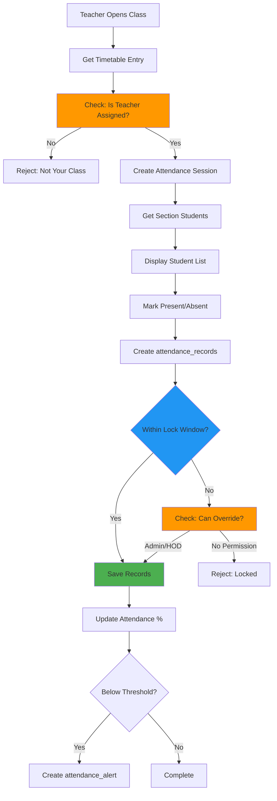
```mermaid
flowchart TD
    A[Teacher Opens Class] --> B[Get Timetable Entry]
    B --> C[Check: Is Teacher Assigned?]
    C -->|No| D[Reject: Not Your Class]
    C -->|Yes| E[Create Attendance Session]
    
    E --> F[Get Section Students]
    F --> G[Display Student List]
    G --> H[Mark Present/Absent]
    
    H --> I[Create attendance_records]
    I --> J{Within Lock Window?}
    J -->|Yes| K[Save Records]
    J -->|No| L[Check: Can Override?]
    
    L -->|Admin/HOD| K
    L -->|No Permission| M[Reject: Locked]
    
    K --> N[Update Attendance %]
    N --> O{Below Threshold?}
    O -->|Yes| P[Create attendance_alert]
    O -->|No| Q[Complete]
    
    style C fill:#FF9800
    style J fill:#2196F3
    style L fill:#FF9800
    style K fill:#4CAF50
```

### Exam Marks Entry & Verification

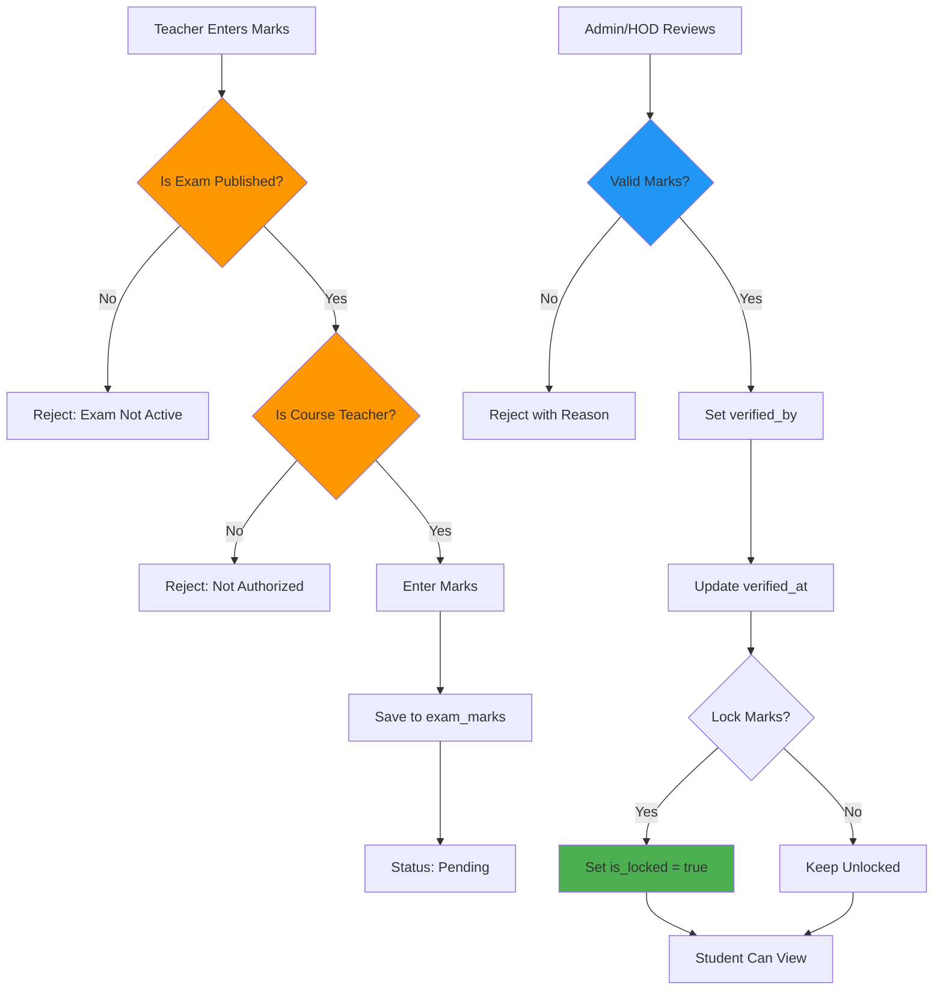
```mermaid
flowchart TD
    A[Teacher Enters Marks] --> B{Is Exam Published?}
    B -->|No| C[Reject: Exam Not Active]
    B -->|Yes| D{Is Course Teacher?}
    
    D -->|No| E[Reject: Not Authorized]
    D -->|Yes| F[Enter Marks]
    
    F --> G[Save to exam_marks]
    G --> H[Status: Pending]
    
    I[Admin/HOD Reviews] --> J{Valid Marks?}
    J -->|No| K[Reject with Reason]
    J -->|Yes| L[Set verified_by]
    
    L --> M[Update verified_at]
    M --> N{Lock Marks?}
    N -->|Yes| O[Set is_locked = true]
    N -->|No| P[Keep Unlocked]
    
    O --> Q[Student Can View]
    P --> Q
    
    style B fill:#FF9800
    style D fill:#FF9800
    style J fill:#2196F3
    style O fill:#4CAF50
```

---

## RLS Policy Visualization

### RLS Architecture Overview

```mermaid
graph TD
    A[Database Query] --> B{RLS Enabled?}
    B -->|Yes| C[Apply RLS Policies]
    B -->|No| D[Direct Access - BLOCKED]
    
    C --> E{User Authenticated?}
    E -->|No| F[Return 401 Unauthorized]
    E -->|Yes| G[Get User Context]
    
    G --> H[Execute Policy Functions]
    H --> I[is_admin]
    H --> J[is_teacher]
    H --> K[is_student]
    H --> L[get_student_id]
    H --> M[get_teacher_id]
    
    I --> N{Check Policies}
    J --> N
    K --> N
    L --> N
    M --> N
    
    N --> O{Any Policy Pass?}
    O -->|Yes| P[Filter & Return Data]
    O -->|No| Q[Return 403 Forbidden]
    
    style B fill:#FF9800
    style C fill:#2196F3
    style H fill:#9C27B0
    style O fill:#FF9800
    style P fill:#4CAF50
    style Q fill:#F44336
    style F fill:#F44336
```

### Policy Execution Flow by Role

```mermaid
stateDiagram-v2
    [*] --> AuthCheck: Query Request
    
    AuthCheck --> GetUserRole: Authenticated
    AuthCheck --> Reject: Not Authenticated
    
    GetUserRole --> SuperAdmin: Super Admin Role
    GetUserRole --> Admin: Admin Role
    GetUserRole --> Teacher: Teacher Role
    GetUserRole --> Student: Student Role
    
    SuperAdmin --> FullAccess: All Tables/All Operations
    Admin --> ScopedAccess: Department/Module Scope
    Teacher --> TeacherAccess: Class/Course Scope
    Student --> StudentAccess: Own Data Only
    
    FullAccess --> ExecuteQuery
    ScopedAccess --> CheckDepartment
    TeacherAccess --> CheckAssignment
    StudentAccess --> CheckOwnership
    
    CheckDepartment --> ExecuteQuery: Department Match
    CheckDepartment --> Reject: No Match
    
    CheckAssignment --> ExecuteQuery: Assigned to Class/Course
    CheckAssignment --> Reject: Not Assigned
    
    CheckOwnership --> ExecuteQuery: Own Record
    CheckOwnership --> Reject: Different User
    
    ExecuteQuery --> [*]: Return Filtered Data
    Reject --> [*]: Return Error
```

### RLS Policy Layers

```mermaid
graph LR
    subgraph "Layer 1: Authentication"
        A1[Supabase Auth]
        A2[Session Token]
        A3[auth.uid]
    end
    
    subgraph "Layer 2: User Context"
        B1[Get Profile]
        B2[Get Roles]
        B3[Get Permissions]
    end
    
    subgraph "Layer 3: Policy Functions"
        C1[is_admin]
        C2[is_teacher]
        C3[is_student]
        C4[get_student_id]
        C5[get_teacher_id]
    end
    
    subgraph "Layer 4: Table Policies"
        D1[SELECT Policy]
        D2[INSERT Policy]
        D3[UPDATE Policy]
        D4[DELETE Policy]
    end
    
    subgraph "Layer 5: Data Filtering"
        E1[Row Filter]
        E2[Column Filter]
        E3[Join Filter]
    end
    
    A1 --> A2
    A2 --> A3
    A3 --> B1
    B1 --> B2
    B2 --> B3
    B3 --> C1
    B3 --> C2
    B3 --> C3
    B3 --> C4
    B3 --> C5
    C1 --> D1
    C1 --> D2
    C1 --> D3
    C1 --> D4
    C2 --> D1
    C2 --> D2
    C3 --> D1
    D1 --> E1
    D2 --> E1
    D3 --> E1
    D4 --> E1
    E1 --> E2
    E2 --> E3
    
    style A1 fill:#4CAF50
    style B2 fill:#FF9800
    style C1 fill:#2196F3
    style C2 fill:#2196F3
    style C3 fill:#2196F3
    style D1 fill:#9C27B0
    style D2 fill:#9C27B0
    style D3 fill:#9C27B0
    style D4 fill:#9C27B0
    style E1 fill:#F44336
```

### Permission Hierarchy

```mermaid
graph TD
    A[Permissions] --> B[Super Admin]
    A --> C[Admin Roles]
    A --> D[Teacher Roles]
    A --> E[Student Role]
    
    B --> B1[full_system_access]
    B --> B2[create_delete_admins]
    B --> B3[manage_global_settings]
    B --> B4[All Module Access]
    
    C --> C1[Principal]
    C --> C2[Department Admin]
    C --> C3[HOD]
    C --> C4[Specialized Admins]
    
    C1 --> C1A[view_all_users]
    C1 --> C1B[approve_planner_final]
    C1 --> C1C[approve_diary_final]
    
    C2 --> C2A[view_dept_users]
    C2 --> C2B[manage_dept_structure]
    
    C3 --> C3A[approve_planner_level_1]
    C3 --> C3B[approve_diary_level_1]
    C3 --> C3C[manage_timetable]
    
    C4 --> C4A[exam_cell_admin]
    C4 --> C4B[library_admin]
    C4 --> C4C[finance_admin]
    C4 --> C4D[bus_admin]
    C4 --> C4E[canteen_admin]
    
    D --> D1[Subject Teacher]
    D --> D2[Class Teacher]
    D --> D3[Mentor]
    D --> D4[Coordinator]
    
    D1 --> D1A[mark_attendance]
    D1 --> D1B[enter_marks]
    D1 --> D1C[create_assignments]
    
    D2 --> D2A[approve_student_leaves]
    D2 --> D2B[view_class_reports]
    
    D3 --> D3A[view_mentee_data]
    
    E --> E1[view_own_data]
    E --> E2[submit_assignments]
    E --> E3[apply_leave]
    E --> E4[order_canteen]
    
    style B fill:#F44336
    style C fill:#FF9800
    style D fill:#4CAF50
    style E fill:#2196F3
```

### RLS Policy Types

```mermaid
flowchart LR
    subgraph "Policy Types"
        A[RLS Policies]
        A --> B[SELECT Policies]
        A --> C[INSERT Policies]
        A --> D[UPDATE Policies]
        A --> E[DELETE Policies]
    end
    
    subgraph "Policy Conditions"
        B --> B1[Self-Access]
        B --> B2[Role-Based]
        B --> B3[Department-Scoped]
        B --> B4[Time-Based]
        B --> B5[Status-Based]
        
        C --> C1[Role Check]
        C --> C2[Assignment Check]
        C --> C3[Quota Check]
        
        D --> D1[Ownership Check]
        D --> D2[Lock Check]
        D --> D3[Approval Level]
        
        E --> E1[Admin Only]
        E --> E2[Soft Delete]
    end
    
    subgraph "Examples"
        B1 -.->|Example| F1["student_id = auth.uid"]
        B2 -.->|Example| F2["is_admin = true"]
        B3 -.->|Example| F3["dept_id IN user_depts"]
        B4 -.->|Example| F4["is_locked = false"]
        C1 -.->|Example| F5["is_teacher AND assigned"]
        D1 -.->|Example| F6["created_by = auth.uid"]
        E1 -.->|Example| F7["is_super_admin"]
    end
    
    style A fill:#9C27B0
    style B fill:#2196F3
    style C fill:#4CAF50
    style D fill:#FF9800
    style E fill:#F44336
```

---

## Data Flow Diagrams

### Complete Student Journey

```mermaid
flowchart TD
    START[Student Registration] --> AUTH[Create Auth Account]
    AUTH --> PROFILE[Create Profile]
    PROFILE --> APPROVAL{Admin Approval}
    APPROVAL -->|Pending| WAIT[Wait for Approval]
    APPROVAL -->|Approved| STUDENT_REC[Create Student Record]
    
    STUDENT_REC --> ASSIGN[Assign to Section]
    ASSIGN --> ENROLL[Enroll in Academic Year]
    
    ENROLL --> LOGIN[Student Logs In]
    LOGIN --> DASHBOARD[View Dashboard]
    
    DASHBOARD --> TIMETABLE[Check Timetable]
    DASHBOARD --> ATTENDANCE[View Attendance]
    DASHBOARD --> MARKS[View Marks]
    DASHBOARD --> ASSIGNMENTS[View Assignments]
    DASHBOARD --> LIBRARY[Library Services]
    DASHBOARD --> FEES[Fee Status]
    DASHBOARD --> BUS[Bus Subscription]
    DASHBOARD --> CANTEEN[Canteen Orders]
    
    TIMETABLE --> T1[Daily Schedule]
    TIMETABLE --> T2[Substitutions]
    
    ATTENDANCE --> A1[Attendance %]
    ATTENDANCE --> A2[Shortage Alerts]
    ATTENDANCE --> A3[Apply Leave]
    
    MARKS --> M1[Internal Marks]
    MARKS --> M2[External Results]
    MARKS --> M3[SGPA/CGPA]
    
    ASSIGNMENTS --> AS1[Pending Assignments]
    ASSIGNMENTS --> AS2[Submit Assignment]
    ASSIGNMENTS --> AS3[View Grades]
    
    LIBRARY --> L1[Search Books]
    LIBRARY --> L2[My Issues]
    LIBRARY --> L3[Reserve Book]
    
    FEES --> F1[Fee Structure]
    FEES --> F2[Payment History]
    FEES --> F3[Pending Amount]
    
    BUS --> B1[View Routes]
    BUS --> B2[Subscribe]
    BUS --> B3[Track Bus]
    
    CANTEEN --> C1[View Menu]
    CANTEEN --> C2[Order Token]
    CANTEEN --> C3[My Orders]
    
    style START fill:#4CAF50
    style APPROVAL fill:#FF9800
    style LOGIN fill:#2196F3
    style DASHBOARD fill:#9C27B0
```

### Complete Teacher Journey

```mermaid
flowchart TD
    START[Teacher Account Creation] --> PROFILE[Create Profile]
    PROFILE --> TEACHER_REC[Create Teacher Record]
    TEACHER_REC --> ASSIGN_DEPT[Assign to Department]
    ASSIGN_DEPT --> ASSIGN_ROLE[Assign Teacher Role]
    
    ASSIGN_ROLE --> ASSIGN_COURSES[Assign Courses]
    ASSIGN_COURSES --> CREATE_TIMETABLE[Create Timetable]
    
    CREATE_TIMETABLE --> LOGIN[Teacher Logs In]
    LOGIN --> DASHBOARD[View Dashboard]
    
    DASHBOARD --> TODAY[Today's Classes]
    DASHBOARD --> ATTENDANCE[Mark Attendance]
    DASHBOARD --> MARKS[Enter Marks]
    DASHBOARD --> ASSIGNMENTS[Manage Assignments]
    DASHBOARD --> MATERIALS[Upload Materials]
    DASHBOARD --> PLANNER[Lesson Planner]
    DASHBOARD --> DIARY[Work Diary]
    DASHBOARD --> CLASS_TOOLS[Class Tools]
    
    TODAY --> T1[View Schedule]
    TODAY --> T2[Request Substitution]
    
    ATTENDANCE --> AT1[Create Session]
    AT1 --> AT2[Mark Students]
    AT2 --> AT3[Submit Attendance]
    AT3 --> AT4{Below 75%?}
    AT4 -->|Yes| AT5[Generate Alert]
    AT4 -->|No| AT6[Save]
    
    MARKS --> MK1[Select Exam]
    MK1 --> MK2[Enter Marks]
    MK2 --> MK3[Submit for Verification]
    MK3 --> MK4{HOD Approves?}
    MK4 -->|Yes| MK5[Publish to Students]
    MK4 -->|No| MK6[Revise Marks]
    
    ASSIGNMENTS --> AS1[Create Assignment]
    AS1 --> AS2[Set Due Date]
    AS2 --> AS3[Publish to Section]
    AS3 --> AS4[Review Submissions]
    AS4 --> AS5[Grade & Feedback]
    
    MATERIALS --> MT1[Upload File]
    MT1 --> MT2[Set Visibility]
    MT2 --> MT3[Publish]
    
    PLANNER --> PL1[Create Plan]
    PL1 --> PL2[Submit]
    PL2 --> PL3{HOD Approval}
    PL3 -->|Approved| PL4{Principal Approval}
    PL3 -->|Rejected| PL5[Revise]
    PL4 -->|Approved| PL6[Implement]
    
    DIARY --> DI1[Daily Entry]
    DI1 --> DI2[Topics Covered]
    DI2 --> DI3[Submit]
    DI3 --> DI4[Approval Flow]
    
    CLASS_TOOLS --> CT1{Is Class Teacher?}
    CT1 -->|Yes| CT2[Approve Leaves]
    CT1 -->|Yes| CT3[Class Reports]
    CT1 -->|No| CT4[Not Accessible]
    
    style START fill:#4CAF50
    style LOGIN fill:#2196F3
    style DASHBOARD fill:#9C27B0
    style AT4 fill:#FF9800
    style MK4 fill:#FF9800
    style PL3 fill:#FF9800
```

### Complete Admin Journey

```mermaid
flowchart TD
    START[Admin Login] --> VERIFY{Verify Admin Role}
    VERIFY -->|Not Admin| REJECT[Access Denied]
    VERIFY -->|Admin| CHECK_ROLE{Check Specific Role}
    
    CHECK_ROLE --> SUPER_ADMIN[Super Admin]
    CHECK_ROLE --> PRINCIPAL[Principal]
    CHECK_ROLE --> DEPT_ADMIN[Department Admin]
    CHECK_ROLE --> HOD[HOD]
    CHECK_ROLE --> SPECIALIZED[Specialized Admin]
    
    SUPER_ADMIN --> SA_MODULES[All Modules Access]
    SA_MODULES --> SA1[User Management]
    SA_MODULES --> SA2[Academic Structure]
    SA_MODULES --> SA3[System Settings]
    SA_MODULES --> SA4[All Reports]
    
    PRINCIPAL --> P_MODULES[Principal Modules]
    P_MODULES --> P1[View All Users]
    P_MODULES --> P2[Final Approvals]
    P_MODULES --> P3[Global Notices]
    P_MODULES --> P4[Analytics]
    
    DEPT_ADMIN --> DA_MODULES[Department Modules]
    DA_MODULES --> DA1[Department Users]
    DA_MODULES --> DA2[Department Structure]
    DA_MODULES --> DA3[Department Reports]
    
    HOD --> HOD_MODULES[HOD Modules]
    HOD_MODULES --> HOD1[L1 Approvals]
    HOD_MODULES --> HOD2[Timetable Management]
    HOD_MODULES --> HOD3[Attendance Reports]
    HOD_MODULES --> HOD4[Leave Approvals]
    
    SPECIALIZED --> SPEC{Which Admin?}
    SPEC --> EXAM[Exam Cell Admin]
    SPEC --> LIB[Library Admin]
    SPEC --> FIN[Finance Admin]
    SPEC --> BUS[Bus Admin]
    SPEC --> CANT[Canteen Admin]
    SPEC --> RECEP[Reception Admin]
    
    EXAM --> EX1[Schedule Exams]
    EXAM --> EX2[Verify Marks]
    EXAM --> EX3[Publish Results]
    
    LIB --> LB1[Manage Books]
    LIB --> LB2[Issue/Return]
    LIB --> LB3[Fine Management]
    
    FIN --> FN1[Fee Structures]
    FIN --> FN2[Payment Collection]
    FIN --> FN3[Financial Reports]
    
    BUS --> BS1[Route Management]
    BUS --> BS2[Vehicle Management]
    BUS --> BS3[Subscription Approvals]
    
    CANT --> CN1[Menu Management]
    CANT --> CN2[Token Management]
    CANT --> CN3[Canteen Reports]
    
    RECEP --> RC1[Gate Passes]
    RECEP --> RC2[Late Passes]
    RECEP --> RC3[Daily Logs]
    
    style START fill:#4CAF50
    style VERIFY fill:#FF9800
    style SUPER_ADMIN fill:#F44336
    style PRINCIPAL fill:#FF9800
    style SPECIALIZED fill:#2196F3
```

### Data Synchronization Flow

```mermaid
sequenceDiagram
    participant Client
    participant Supabase
    participant RLS
    participant Database
    participant Storage
    participant Realtime
    
    Client->>Supabase: Query Request
    Supabase->>RLS: Check Authentication
    RLS->>RLS: Get auth.uid()
    RLS->>Database: Execute Policy Functions
    Database->>RLS: Return User Context
    RLS->>Database: Apply Row Filters
    Database->>RLS: Filtered Data
    RLS->>Supabase: Authorized Data
    Supabase->>Client: Response
    
    Note over Client,Realtime: Real-time Subscription
    
    Client->>Realtime: Subscribe to Table
    Realtime->>RLS: Apply RLS Policies
    Database->>Realtime: Data Change Event
    Realtime->>RLS: Filter Event
    RLS->>Realtime: Authorized Event
    Realtime->>Client: Push Update
    
    Note over Client,Storage: File Upload
    
    Client->>Storage: Upload File
    Storage->>RLS: Check Bucket Policy
    RLS->>Storage: Authorize Upload
    Storage->>Storage: Store File
    Storage->>Database: Save Metadata
    Database->>Client: File URL
```

### Approval Workflow System

```mermaid
stateDiagram-v2
    [*] --> Draft: Create Document
    
    Draft --> SubmittedL1: Submit for L1 Approval
    Draft --> [*]: Cancel
    
    SubmittedL1 --> ReviewL1: HOD Reviews
    
    ReviewL1 --> ApprovedL1: HOD Approves
    ReviewL1 --> RejectedL1: HOD Rejects
    
    RejectedL1 --> Draft: Revise
    
    ApprovedL1 --> SubmittedFinal: Forward to Principal
    
    SubmittedFinal --> ReviewFinal: Principal Reviews
    
    ReviewFinal --> ApprovedFinal: Principal Approves
    ReviewFinal --> RejectedFinal: Principal Rejects
    
    RejectedFinal --> SubmittedL1: Send Back to HOD
    
    ApprovedFinal --> Implemented: In Effect
    
    Implemented --> Archived: Academic Year End
    
    Archived --> [*]
    
    note right of ReviewL1
        RLS: Only HOD of
        same department
        can approve L1
    end note
    
    note right of ReviewFinal
        RLS: Only Principal
        can approve final
    end note
```

### Attendance Marking Flow

```mermaid
sequenceDiagram
    participant Teacher
    participant UI
    participant TimetableAPI
    participant AttendanceAPI
    participant RLS
    participant Database
    participant AlertSystem
    
    Teacher->>UI: Open Today's Classes
    UI->>TimetableAPI: Get Teacher's Schedule
    TimetableAPI->>RLS: Check teacher_id
    RLS->>Database: Filter by teacher_courses
    Database->>TimetableAPI: Return Classes
    TimetableAPI->>UI: Display Schedule
    
    Teacher->>UI: Select Class to Mark
    UI->>AttendanceAPI: Create Session
    AttendanceAPI->>RLS: Verify Teacher Assignment
    RLS->>Database: Check teacher_course_id
    
    alt Teacher Assigned
        Database->>AttendanceAPI: Authorized
        AttendanceAPI->>Database: Create attendance record
        Database->>AttendanceAPI: Session Created
        AttendanceAPI->>UI: Load Student List
        
        Teacher->>UI: Mark Present/Absent
        UI->>AttendanceAPI: Submit Attendance
        AttendanceAPI->>Database: Insert attendance_records
        
        Database->>AlertSystem: Calculate Attendance %
        
        alt Below 75%
            AlertSystem->>Database: Create attendance_alert
            AlertSystem->>UI: Show Warning
        end
        
        Database->>AttendanceAPI: Success
        AttendanceAPI->>UI: Confirm Submission
    else Not Assigned
        Database->>RLS: Reject
        RLS->>AttendanceAPI: 403 Forbidden
        AttendanceAPI->>UI: Error: Not Your Class
    end
```

---

### RLS Enabled Tables

All tables in the database have RLS enabled for security.

```mermaid
graph TB
    subgraph "Tables with RLS"
        T1[profiles]
        T2[user_roles]
        T3[students]
        T4[teachers]
        T5[departments]
        T6[courses]
        T7[timetable_entries]
        T8[attendance]
        T9[attendance_records]
        T10[exam_marks]
        T11[external_marks]
        T12[assignments]
        T13[assignment_submissions]
        T14[teaching_materials]
        T15[books]
        T16[book_issues]
        T17[student_fees]
        T18[fee_payments]
        T19[bus_subscriptions]
        T20[canteen_tokens]
        T21[notices]
        T22[events]
        T23[lesson_planners]
        T24[work_diary_entries]
        T25[gate_passes]
        T26[... 17 more tables]
    end
    
    subgraph "RLS Status"
        ENABLED[✓ RLS Enabled on ALL Tables]
        POLICIES[150+ Active Policies]
        FUNCTIONS[9 Security Functions]
    end
    
    T1 --> ENABLED
    T5 --> ENABLED
    T10 --> ENABLED
    T15 --> ENABLED
    T20 --> ENABLED
    T25 --> ENABLED
    
    ENABLED --> POLICIES
    POLICIES --> FUNCTIONS
    
    style ENABLED fill:#4CAF50
    style POLICIES fill:#2196F3
    style FUNCTIONS fill:#FF9800
```

### Common RLS Policies

#### 1. **Self-Access Policy** (profiles, students, teachers)

```sql
-- Users can view their own record
CREATE POLICY "Users can view own profile"
ON profiles FOR SELECT
USING (auth.uid() = id);

-- Users can update their own profile
CREATE POLICY "Users can update own profile"
ON profiles FOR UPDATE
USING (auth.uid() = id);
```

#### 2. **Admin Full Access Policy** (all tables)

```sql
-- Admins can perform all operations
CREATE POLICY "Admins full access"
ON [table_name] FOR ALL
USING (is_admin());
```

#### 3. **Teacher Access Policy** (students, attendance, marks)

```sql
-- Teachers can view all students
CREATE POLICY "Teachers can view students"
ON students FOR SELECT
USING (is_teacher());

-- Teachers can mark attendance for their classes
CREATE POLICY "Teachers mark attendance"
ON attendance FOR INSERT
USING (
    is_teacher() AND
    EXISTS (
        SELECT 1 FROM timetable_entries te
        JOIN teacher_courses tc ON te.teacher_course_id = tc.id
        WHERE tc.teacher_id = get_teacher_id(auth.uid())
        AND te.id = timetable_entry_id
    )
);
```

#### 4. **Student Read-Only Policy** (own data)

```sql
-- Students can view their own records
CREATE POLICY "Students view own records"
ON exam_marks FOR SELECT
USING (
    student_id = get_student_id(auth.uid()) AND
    verified_at IS NOT NULL
);

-- Students can view their attendance
CREATE POLICY "Students view own attendance"
ON attendance_records FOR SELECT
USING (student_id = get_student_id(auth.uid()));
```

#### 5. **Department Scope Policy** (department admins)

```sql
-- Department admins can view department students
CREATE POLICY "Dept admin view dept students"
ON students FOR SELECT
USING (
    is_admin() AND
    department_id IN (
        SELECT department_id FROM user_roles
        WHERE user_id = auth.uid()
        AND role_id IN (SELECT id FROM roles WHERE name = 'department_admin')
    )
);
```

### RLS Security Functions

#### is_admin()
```sql
CREATE OR REPLACE FUNCTION is_admin()
RETURNS BOOLEAN AS $$
BEGIN
    RETURN EXISTS (
        SELECT 1 FROM user_roles ur
        JOIN roles r ON ur.role_id = r.id
        WHERE ur.user_id = auth.uid()
        AND r.category IN ('super_admin', 'admin')
        AND ur.is_active = true
    );
END;
$$ LANGUAGE plpgsql SECURITY DEFINER;
```

#### is_teacher()
```sql
CREATE OR REPLACE FUNCTION is_teacher()
RETURNS BOOLEAN AS $$
BEGIN
    RETURN EXISTS (
        SELECT 1 FROM user_roles ur
        JOIN roles r ON ur.role_id = r.id
        WHERE ur.user_id = auth.uid()
        AND r.category = 'teacher'
        AND ur.is_active = true
    );
END;
$$ LANGUAGE plpgsql SECURITY DEFINER;
```

#### get_student_id()
```sql
CREATE OR REPLACE FUNCTION get_student_id(user_uuid UUID)
RETURNS UUID AS $$
BEGIN
    RETURN (SELECT id FROM students WHERE user_id = user_uuid);
END;
$$ LANGUAGE plpgsql SECURITY DEFINER;
```

#### get_teacher_id()
```sql
CREATE OR REPLACE FUNCTION get_teacher_id(user_uuid UUID)
RETURNS UUID AS $$
BEGIN
    RETURN (SELECT id FROM teachers WHERE user_id = user_uuid);
END;
$$ LANGUAGE plpgsql SECURITY DEFINER;
```

### RLS Policy Matrix

| Table | Admin | Teacher | Student | Public |
|-------|-------|---------|---------|--------|
| **profiles** | Full | Read All | Own Only | None |
| **user_roles** | Full | Read Own | Read Own | None |
| **students** | Full | Read All | Own Only | None |
| **teachers** | Full | Read All | Own Only | None |
| **departments** | Full | Read All | Read All | None |
| **courses** | Full | Read All | Read All | None |
| **timetable_entries** | Full | Read + Assigned | Read Own | None |
| **attendance** | Full | CRUD Assigned | Read Own | None |
| **attendance_records** | Full | CRUD Assigned | Read Own | None |
| **exam_marks** | Full | CRUD Assigned | Read Verified | None |
| **external_marks** | Full | Read All | Own Only | None |
| **assignments** | Full | CRUD Own | Read + Submit | None |
| **assignment_submissions** | Full | Read + Grade | Own CRUD | None |
| **teaching_materials** | Full | CRUD Own | Read All | None |
| **books** | Full + Library | Read All | Read All | None |
| **book_issues** | Full + Library | Read All | Own Only | None |
| **fee_structures** | Full + Finance | Read All | Read All | None |
| **student_fees** | Full + Finance | Read All | Own Only | None |
| **fee_payments** | Full + Finance | Read All | Own Only | None |
| **bus_routes** | Full + Bus | Read All | Read All | None |
| **bus_subscriptions** | Full + Bus | Read All | Own CRUD | None |
| **canteen_menu_items** | Full + Canteen | Read All | Read All | None |
| **canteen_tokens** | Full + Canteen | Read + Update | Own CRUD | None |
| **notices** | Full + Create | Create Dept | Read All | None |
| **events** | Full + Create | Read All | Read All | None |
| **lesson_planners** | Full + Approve | Own CRUD | None | None |
| **work_diary_entries** | Full + Approve | Own CRUD | None | None |
| **gate_passes** | Full + Reception | Read All | Own CRUD | None |
| **late_passes** | Full + Reception | Read All | Own Only | None |
| **feedback** | Full | Read All | Own CRUD | None |
| **complaints** | Full | Read All | Own CRUD | None |

### Special RLS Scenarios

#### 1. **Approval Workflows**
```sql
-- HOD can approve level 1
CREATE POLICY "HOD approve L1"
ON lesson_planners FOR UPDATE
USING (
    EXISTS (
        SELECT 1 FROM user_roles ur
        JOIN roles r ON ur.role_id = r.id
        WHERE ur.user_id = auth.uid()
        AND r.name = 'hod'
        AND ur.department_id = (
            SELECT department_id FROM teachers
            WHERE id = lesson_planners.teacher_id
        )
    )
)
WITH CHECK (approval_status_l1 IN ('approved', 'rejected'));

-- Principal can approve final
CREATE POLICY "Principal approve final"
ON lesson_planners FOR UPDATE
USING (
    EXISTS (
        SELECT 1 FROM user_roles ur
        JOIN roles r ON ur.role_id = r.id
        WHERE ur.user_id = auth.uid()
        AND r.name = 'principal'
    )
)
WITH CHECK (approval_status_final IN ('approved', 'rejected'));
```

#### 2. **Time-Based Locks**
```sql
-- Can only edit attendance within lock window
CREATE POLICY "Edit within lock window"
ON attendance FOR UPDATE
USING (
    (is_admin() OR is_teacher()) AND
    (is_locked = false OR is_admin())
);
```

#### 3. **Department-Scoped Access**
```sql
-- Department admin can only manage own department
CREATE POLICY "Dept admin dept scope"
ON students FOR ALL
USING (
    is_admin() AND
    (
        is_super_admin() OR
        department_id IN (
            SELECT department_id FROM user_roles
            WHERE user_id = auth.uid()
        )
    )
);
```

---

## Table Relationships

### Complete Relationship Map

```mermaid
graph TB
    subgraph "Core Identity"
        AUTH_USERS[auth.users<br/>Supabase Managed]
        PROFILES[profiles<br/>User Info]
        USER_ROLES[user_roles<br/>Role Assignments]
        ROLES[roles<br/>Role Definitions]
    end
    
    subgraph "Student Domain"
        STUDENTS[students<br/>Student Records]
        ATT_RECORDS[attendance_records]
        EXAM_MARKS[exam_marks]
        SUBMISSIONS[assignment_submissions]
        BOOK_ISSUES[book_issues]
        STUDENT_FEES[student_fees]
        BUS_SUBS[bus_subscriptions]
        TOKENS[canteen_tokens]
        GATE_PASSES[gate_passes]
    end
    
    subgraph "Teacher Domain"
        TEACHERS[teachers<br/>Teacher Records]
        TEACHER_COURSES[teacher_courses<br/>Teaching Assignments]
        TIMETABLE[timetable_entries]
        ATTENDANCE[attendance]
        ASSIGNMENTS[assignments]
        MATERIALS[teaching_materials]
        PLANNERS[lesson_planners]
        DIARY[work_diary_entries]
    end
    
    subgraph "Academic Structure"
        DEPTS[departments]
        YEARS[years]
        SEMS[semesters]
        SECTIONS[sections]
        COURSES[courses]
        ACAD_YEARS[academic_years]
    end
    
    subgraph "Examination"
        EXAMS[exams]
        EXAM_SCHED[exam_schedules]
        EXTERNAL[external_marks]
    end
    
    subgraph "Services"
        BOOKS[books]
        FEE_STRUCT[fee_structures]
        PAYMENTS[fee_payments]
        BUS_ROUTES[bus_routes]
        BUS_STOPS[bus_stops]
        BUS_VEHICLES[bus_vehicles]
        MENU[canteen_menu_items]
        DAILY_MENU[canteen_daily_menu]
    end
    
    subgraph "Communication"
        NOTICES[notices]
        NOTICE_READS[notice_reads]
        EVENTS[events]
        EVENT_CERTS[event_certificates]
    end
    
    %% Core relationships
    AUTH_USERS -->|1:1| PROFILES
    PROFILES -->|1:N| USER_ROLES
    ROLES -->|1:N| USER_ROLES
    PROFILES -->|1:1| STUDENTS
    PROFILES -->|1:1| TEACHERS
    
    %% Academic relationships
    DEPTS -->|1:N| SECTIONS
    DEPTS -->|1:N| COURSES
    DEPTS -->|1:N| STUDENTS
    DEPTS -->|1:N| TEACHERS
    YEARS -->|1:N| SEMS
    YEARS -->|1:N| SECTIONS
    SEMS -->|1:N| COURSES
    SECTIONS -->|1:N| STUDENTS
    ACAD_YEARS -->|1:N| STUDENTS
    
    %% Teaching relationships
    TEACHERS -->|1:N| TEACHER_COURSES
    COURSES -->|1:N| TEACHER_COURSES
    SECTIONS -->|1:N| TEACHER_COURSES
    TEACHER_COURSES -->|1:N| TIMETABLE
    TIMETABLE -->|1:N| ATTENDANCE
    ATTENDANCE -->|1:N| ATT_RECORDS
    STUDENTS -->|1:N| ATT_RECORDS
    
    %% Exam relationships
    EXAMS -->|1:N| EXAM_SCHED
    COURSES -->|1:N| EXAM_SCHED
    EXAM_SCHED -->|1:N| EXAM_MARKS
    STUDENTS -->|1:N| EXAM_MARKS
    STUDENTS -->|1:N| EXTERNAL
    
    %% Assignment relationships
    TEACHERS -->|1:N| ASSIGNMENTS
    ASSIGNMENTS -->|1:N| SUBMISSIONS
    STUDENTS -->|1:N| SUBMISSIONS
    
    %% Service relationships
    BOOKS -->|1:N| BOOK_ISSUES
    STUDENTS -->|1:N| BOOK_ISSUES
    FEE_STRUCT -->|1:N| STUDENT_FEES
    STUDENTS -->|1:N| STUDENT_FEES
    STUDENT_FEES -->|1:N| PAYMENTS
    BUS_ROUTES -->|1:N| BUS_SUBS
    STUDENTS -->|1:N| BUS_SUBS
    MENU -->|1:N| DAILY_MENU
    DAILY_MENU -->|1:N| TOKENS
    STUDENTS -->|1:N| TOKENS
    
    style AUTH_USERS fill:#4CAF50
    style PROFILES fill:#4CAF50
    style STUDENTS fill:#2196F3
    style TEACHERS fill:#FF9800
    style DEPTS fill:#9C27B0
```

### Cascade Delete Rules

```mermaid
graph TD
    A[DELETE profiles] -->|CASCADE| B[DELETE students]
    A -->|CASCADE| C[DELETE teachers]
    A -->|CASCADE| D[DELETE user_roles]
    
    B -->|CASCADE| E[DELETE attendance_records]
    B -->|CASCADE| F[DELETE exam_marks]
    B -->|CASCADE| G[DELETE assignment_submissions]
    B -->|CASCADE| H[DELETE book_issues]
    B -->|CASCADE| I[DELETE student_fees]
    
    C -->|CASCADE| J[DELETE teacher_courses]
    C -->|CASCADE| K[DELETE assignments]
    C -->|CASCADE| L[DELETE teaching_materials]
    
    J -->|CASCADE| M[DELETE timetable_entries]
    M -->|CASCADE| N[DELETE attendance]
    N -->|CASCADE| O[DELETE attendance_records]
    
    P[DELETE departments] -->|SET NULL| Q[departments.hod_user_id]
    P -->|SET NULL| R[students.department_id]
    P -->|SET NULL| S[teachers.department_id]
    
    T[DELETE sections] -->|SET NULL| U[students.section_id]
    T -->|SET NULL| V[sections.class_teacher_id]
    
    style A fill:#F44336
    style B fill:#FF9800
    style C fill:#FF9800
    style P fill:#FF5722
```

### Database Indexes

```mermaid
graph LR
    subgraph "Primary Indexes"
        PK1[profiles.id]
        PK2[students.id]
        PK3[teachers.id]
        PK4[attendance_records.id]
        PK5[exam_marks.id]
    end
    
    subgraph "Unique Indexes"
        UK1[profiles.email]
        UK2[students.registration_number]
        UK3[teachers.employee_id]
        UK4[books.isbn]
        UK5[bus_vehicles.vehicle_number]
    end
    
    subgraph "Foreign Key Indexes"
        FK1[students.user_id]
        FK2[students.section_id]
        FK3[teachers.department_id]
        FK4[attendance_records.student_id]
        FK5[exam_marks.student_id]
        FK6[user_roles.user_id]
    end
    
    subgraph "Query Optimization Indexes"
        QI1[attendance.session_date]
        QI2[exam_marks.exam_schedule_id]
        QI3[assignment_submissions.assignment_id]
        QI4[notices.created_at]
        QI5[fee_payments.payment_date]
    end
    
    PK1 -.->|Ensures Uniqueness| DATA1[(Data)]
    UK1 -.->|Prevents Duplicates| DATA1
    FK1 -.->|Speeds up Joins| DATA1
    QI1 -.->|Fast WHERE Clause| DATA1
    
    style PK1 fill:#4CAF50
    style UK1 fill:#FF9800
    style FK1 fill:#2196F3
    style QI1 fill:#9C27B0
```

### Foreign Key Summary

```mermaid
erDiagram
    PROFILES ||--o{ USER_ROLES : "has many"
    PROFILES ||--o| STUDENTS : "is a"
    PROFILES ||--o| TEACHERS : "is a"
    
    ROLES ||--o{ USER_ROLES : "assigned to"
    DEPARTMENTS ||--o{ USER_ROLES : "scoped to"
    
    DEPARTMENTS ||--o{ STUDENTS : "enrolled in"
    DEPARTMENTS ||--o{ TEACHERS : "works in"
    DEPARTMENTS ||--o{ COURSES : "offers"
    DEPARTMENTS ||--o{ SECTIONS : "owns"
    
    SECTIONS ||--o{ STUDENTS : "contains"
    SECTIONS ||--|| TEACHERS : "class teacher"
    
    COURSES ||--o{ TEACHER_COURSES : "taught as"
    TEACHERS ||--o{ TEACHER_COURSES : "teaches"
    SECTIONS ||--o{ TEACHER_COURSES : "assigned to"
    
    TEACHER_COURSES ||--o{ TIMETABLE_ENTRIES : "scheduled in"
    TIMETABLE_ENTRIES ||--o{ ATTENDANCE : "sessions"
    ATTENDANCE ||--o{ ATTENDANCE_RECORDS : "contains"
    STUDENTS ||--o{ ATTENDANCE_RECORDS : "marked for"
    
    EXAMS ||--o{ EXAM_SCHEDULES : "has schedule"
    COURSES ||--o{ EXAM_SCHEDULES : "exam for"
    EXAM_SCHEDULES ||--o{ EXAM_MARKS : "marks in"
    STUDENTS ||--o{ EXAM_MARKS : "obtained by"
    
    STUDENTS ||--o{ EXTERNAL_MARKS : "university results"
    STUDENTS ||--o{ ASSIGNMENT_SUBMISSIONS : "submits"
    STUDENTS ||--o{ BOOK_ISSUES : "borrows"
    STUDENTS ||--o{ STUDENT_FEES : "pays"
    STUDENTS ||--o{ BUS_SUBSCRIPTIONS : "subscribes"
    STUDENTS ||--o{ CANTEEN_TOKENS : "orders"
    STUDENTS ||--o{ GATE_PASSES : "requests"
    
    TEACHERS ||--o{ ASSIGNMENTS : "creates"
    TEACHERS ||--o{ TEACHING_MATERIALS : "uploads"
    TEACHERS ||--o{ LESSON_PLANNERS : "plans"
    TEACHERS ||--o{ WORK_DIARY_ENTRIES : "writes"
```

---

### Foreign Key Summary

| Child Table | Parent Table | Relationship | Constraint |
|-------------|--------------|--------------|------------|
| user_roles | profiles | Many-to-One | ON DELETE CASCADE |
| user_roles | roles | Many-to-One | ON DELETE CASCADE |
| user_roles | departments | Many-to-One | ON DELETE SET NULL |
| students | profiles | One-to-One | ON DELETE CASCADE |
| students | departments | Many-to-One | ON DELETE SET NULL |
| students | sections | Many-to-One | ON DELETE SET NULL |
| students | academic_years | Many-to-One | ON DELETE SET NULL |
| teachers | profiles | One-to-One | ON DELETE CASCADE |
| teachers | departments | Many-to-One | ON DELETE SET NULL |
| sections | departments | Many-to-One | ON DELETE CASCADE |
| sections | years | Many-to-One | ON DELETE CASCADE |
| sections | teachers | Many-to-One (class_teacher) | ON DELETE SET NULL |
| courses | departments | Many-to-One | ON DELETE CASCADE |
| courses | semesters | Many-to-One | ON DELETE CASCADE |
| teacher_courses | teachers | Many-to-One | ON DELETE CASCADE |
| teacher_courses | courses | Many-to-One | ON DELETE CASCADE |
| teacher_courses | sections | Many-to-One | ON DELETE CASCADE |
| timetable_entries | teacher_courses | Many-to-One | ON DELETE CASCADE |
| attendance | timetable_entries | Many-to-One | ON DELETE CASCADE |
| attendance_records | attendance | Many-to-One | ON DELETE CASCADE |
| attendance_records | students | Many-to-One | ON DELETE CASCADE |
| exam_schedules | exams | Many-to-One | ON DELETE CASCADE |
| exam_schedules | courses | Many-to-One | ON DELETE CASCADE |
| exam_marks | exam_schedules | Many-to-One | ON DELETE CASCADE |
| exam_marks | students | Many-to-One | ON DELETE CASCADE |
| external_marks | students | Many-to-One | ON DELETE CASCADE |
| assignments | teachers | Many-to-One | ON DELETE CASCADE |
| assignments | courses | Many-to-One | ON DELETE CASCADE |
| assignment_submissions | assignments | Many-to-One | ON DELETE CASCADE |
| assignment_submissions | students | Many-to-One | ON DELETE CASCADE |
| book_issues | books | Many-to-One | ON DELETE CASCADE |
| book_issues | students | Many-to-One | ON DELETE CASCADE |
| student_fees | students | Many-to-One | ON DELETE CASCADE |
| student_fees | fee_structures | Many-to-One | ON DELETE CASCADE |
| fee_payments | student_fees | Many-to-One | ON DELETE CASCADE |
| bus_subscriptions | students | Many-to-One | ON DELETE CASCADE |
| bus_subscriptions | bus_routes | Many-to-One | ON DELETE CASCADE |
| canteen_tokens | students | Many-to-One | ON DELETE CASCADE |
| canteen_tokens | canteen_menu_items | Many-to-One | ON DELETE CASCADE |

### Index Strategy

Key indexes for performance:

```sql
-- User lookup
CREATE INDEX idx_profiles_email ON profiles(email);
CREATE INDEX idx_user_roles_user_id ON user_roles(user_id);

-- Student lookups
CREATE INDEX idx_students_user_id ON students(user_id);
CREATE INDEX idx_students_registration ON students(registration_number);
CREATE INDEX idx_students_section ON students(section_id);

-- Teacher lookups
CREATE INDEX idx_teachers_user_id ON teachers(user_id);
CREATE INDEX idx_teachers_department ON teachers(department_id);
CREATE INDEX idx_teacher_courses_teacher ON teacher_courses(teacher_id);

-- Attendance queries
CREATE INDEX idx_attendance_records_student ON attendance_records(student_id);
CREATE INDEX idx_attendance_records_attendance ON attendance_records(attendance_id);
CREATE INDEX idx_attendance_date ON attendance(session_date);

-- Exam marks
CREATE INDEX idx_exam_marks_student ON exam_marks(student_id);
CREATE INDEX idx_exam_marks_schedule ON exam_marks(exam_schedule_id);

-- Assignments
CREATE INDEX idx_assignment_submissions_student ON assignment_submissions(student_id);
CREATE INDEX idx_assignment_submissions_assignment ON assignment_submissions(assignment_id);
```

---

## Security Functions

### Complete Function List

| Function | Purpose | Security Level |
|----------|---------|----------------|
| `is_admin()` | Check if user has admin role | SECURITY DEFINER |
| `is_teacher()` | Check if user has teacher role | SECURITY DEFINER |
| `is_super_admin()` | Check if user is super admin | SECURITY DEFINER |
| `get_student_id(uuid)` | Get student ID from user ID | SECURITY DEFINER |
| `get_teacher_id(uuid)` | Get teacher ID from user ID | SECURITY DEFINER |
| `get_user_roles(uuid)` | Get all roles for user | SECURITY DEFINER |
| `get_current_academic_year()` | Get active academic year | SECURITY DEFINER |
| `handle_new_user()` | Auto-create profile on signup | SECURITY DEFINER |
| `update_updated_at()` | Auto-update timestamps | SECURITY DEFINER |

### Function Call Flow

```mermaid
sequenceDiagram
    participant Query as SQL Query
    participant RLS as RLS Policy
    participant Func as Security Function
    participant DB as Database
    participant Cache as Function Cache
    
    Query->>RLS: Execute Query
    RLS->>Func: Call is_admin()
    
    Func->>Cache: Check Cache
    
    alt Cache Hit
        Cache->>Func: Return Cached Result
    else Cache Miss
        Func->>DB: SELECT from user_roles
        DB->>Func: Return Roles
        Func->>Cache: Store Result
    end
    
    Func->>RLS: Return Boolean
    RLS->>Query: Apply Filter
    Query->>DB: Execute with Filter
    DB->>Query: Return Data
```

### Security Function Implementation

```mermaid
graph TB
    subgraph "is_admin Function"
        A1[Input: None - Uses auth.uid]
        A2[Query user_roles table]
        A3{Join with roles}
        A4{Check category}
        A5[category IN<br/>super_admin, admin]
        A6{is_active = true}
        A7[Return Boolean]
        
        A1 --> A2
        A2 --> A3
        A3 --> A4
        A4 --> A5
        A5 --> A6
        A6 --> A7
    end
    
    subgraph "is_teacher Function"
        B1[Input: None - Uses auth.uid]
        B2[Query user_roles table]
        B3{Join with roles}
        B4{Check category}
        B5[category = 'teacher']
        B6{is_active = true}
        B7[Return Boolean]
        
        B1 --> B2
        B2 --> B3
        B3 --> B4
        B4 --> B5
        B5 --> B6
        B6 --> B7
    end
    
    subgraph "get_student_id Function"
        C1[Input: user_uuid]
        C2[Query students table]
        C3[WHERE user_id = user_uuid]
        C4[Return student.id]
        
        C1 --> C2
        C2 --> C3
        C3 --> C4
    end
    
    subgraph "get_teacher_id Function"
        D1[Input: user_uuid]
        D2[Query teachers table]
        D3[WHERE user_id = user_uuid]
        D4[Return teacher.id]
        
        D1 --> D2
        D2 --> D3
        D3 --> D4
    end
    
    style A7 fill:#4CAF50
    style B7 fill:#4CAF50
    style C4 fill:#2196F3
    style D4 fill:#2196F3
```

### Trigger System

```mermaid
graph LR
    subgraph "Auth Triggers"
        T1[auth.users INSERT]
        T1 -->|TRIGGER| F1[handle_new_user]
        F1 --> A1[Create Profile Record]
        A1 --> A2[Set primary_role = student]
        A2 --> A3[Set status = pending]
    end
    
    subgraph "Update Triggers"
        T2[profiles UPDATE]
        T3[students UPDATE]
        T4[teachers UPDATE]
        
        T2 -->|TRIGGER| F2[update_updated_at]
        T3 -->|TRIGGER| F2
        T4 -->|TRIGGER| F2
        
        F2 --> B1[Set updated_at = NOW]
    end
    
    style T1 fill:#4CAF50
    style F1 fill:#FF9800
    style F2 fill:#2196F3
```

### Function Performance Optimization

```mermaid
graph TD
    A[Query with RLS] --> B{Function Call}
    B --> C[Check Query Plan Cache]
    
    C -->|Cache Hit| D[Use Cached Plan]
    C -->|Cache Miss| E[Generate Plan]
    
    E --> F[Optimize Query]
    F --> G[Store in Cache]
    G --> D
    
    D --> H[Execute Query]
    H --> I{Result Size}
    
    I -->|Small < 100 rows| J[Return All]
    I -->|Large > 100 rows| K[Apply LIMIT]
    
    J --> L[Client]
    K --> L
    
    subgraph "Optimization Techniques"
        M[Use SECURITY DEFINER]
        N[Index on user_id]
        O[Partial Indexes]
        P[Materialized Views]
    end
    
    F -.-> M
    F -.-> N
    F -.-> O
    F -.-> P
    
    style C fill:#FF9800
    style D fill:#4CAF50
    style M fill:#2196F3
```

### Security Definer vs Invoker

```mermaid
graph LR
    subgraph "SECURITY DEFINER"
        SD1[Function Runs with]
        SD2[Owner's Privileges]
        SD3[Bypasses RLS for Function]
        SD4[Use for: Auth Checks]
        
        SD1 --> SD2
        SD2 --> SD3
        SD3 --> SD4
    end
    
    subgraph "SECURITY INVOKER"
        SI1[Function Runs with]
        SI2[Caller's Privileges]
        SI3[Respects RLS]
        SI4[Use for: Business Logic]
        
        SI1 --> SI2
        SI2 --> SI3
        SI3 --> SI4
    end
    
    subgraph "Our Choice"
        CHOICE[All Security Functions]
        CHOICE --> DEFINER[SECURITY DEFINER]
        DEFINER --> WHY[Access user_roles<br/>without recursion]
    end
    
    style SD2 fill:#F44336
    style SI2 fill:#4CAF50
    style DEFINER fill:#FF9800
```

---

## Database Statistics

### Performance Metrics

```mermaid
graph LR
    subgraph "Query Performance"
        Q1[Average Query Time]
        Q2[< 50ms for indexed queries]
        Q3[< 200ms for complex joins]
        Q4[< 500ms for reports]
        
        Q1 --> Q2
        Q1 --> Q3
        Q1 --> Q4
    end
    
    subgraph "RLS Impact"
        R1[RLS Overhead]
        R2[+5-10ms per query]
        R3[Cached after first call]
        R4[Negligible on repeated queries]
        
        R1 --> R2
        R2 --> R3
        R3 --> R4
    end
    
    subgraph "Index Coverage"
        I1[Total Indexes: 50+]
        I2[Primary Keys: 42]
        I3[Unique Keys: 15]
        I4[Foreign Keys: 60+]
        I5[Query Indexes: 25]
        
        I1 --> I2
        I1 --> I3
        I1 --> I4
        I1 --> I5
    end
    
    style Q2 fill:#4CAF50
    style R4 fill:#4CAF50
    style I1 fill:#2196F3
```

### Data Volume Capacity

```mermaid
graph TB
    subgraph "Estimated Capacity"
        C1[Students: 10,000+]
        C2[Teachers: 500+]
        C3[Attendance Records: 5M+]
        C4[Exam Marks: 1M+]
        C5[Assignments: 50K+]
        C6[Total Rows: 10M+]
    end
    
    subgraph "Storage"
        S1[Database: PostgreSQL]
        S2[File Storage: Supabase Storage]
        S3[Estimated DB Size: 5-10 GB]
        S4[File Storage: 50-100 GB]
    end
    
    subgraph "Scalability"
        SC1[Horizontal: Read Replicas]
        SC2[Vertical: Increase Resources]
        SC3[Partitioning: By Academic Year]
        SC4[Archiving: Old Records]
    end
    
    C6 --> S3
    S3 --> SC3
    
    style C6 fill:#4CAF50
    style S3 fill:#2196F3
    style SC3 fill:#FF9800
```

### Security Coverage

```mermaid
pie title "Security Coverage (150+ Policies)"
    "Admin Full Access" : 42
    "Teacher Scoped Access" : 35
    "Student Self Access" : 40
    "Public Read" : 8
    "Department Scoped" : 15
    "Time-Based Locks" : 10
```

| Metric | Count |
|--------|-------|
| Total Tables | 42 |
| Tables with RLS | 42 (100%) |
| Total RLS Policies | 150+ |
| Security Functions | 9 |
| Triggers | 4+ |
| Indexes | 50+ |
| Foreign Keys | 60+ |
| Storage Buckets | 4 |
| Unique Constraints | 15+ |
| Check Constraints | 20+ |

---

## Migration System

### Migration Flow

```mermaid
graph TD
    A[New Feature Request] --> B[Design Schema Changes]
    B --> C[Write Migration SQL]
    C --> D[Test Locally]
    
    D --> E{Test Pass?}
    E -->|No| F[Fix Issues]
    F --> C
    E -->|Yes| G[Create Migration File]
    
    G --> H[Name: YYYYMMDDHHMMSS_description.sql]
    H --> I[Add to supabase/migrations/]
    
    I --> J[Run: supabase db push]
    J --> K[Apply to Remote DB]
    
    K --> L{Success?}
    L -->|No| M[Rollback]
    M --> N[Fix & Retry]
    N --> C
    L -->|Yes| O[Update Schema Docs]
    
    O --> P[Test RLS Policies]
    P --> Q[Verify Access Control]
    Q --> R[Deploy to Production]
    
    style D fill:#FF9800
    style E fill:#FF9800
    style L fill:#FF9800
    style R fill:#4CAF50
```

### Migration History

```mermaid
timeline
    title Database Migration Timeline
    2024-11 : Initial Schema
            : Core tables created
            : Basic RLS policies
    2024-12 : Extended Features
            : Attendance system v1
            : Timetable updates
            : Role permissions
    2025-01 : Major Enhancements
            : Student module RLS
            : Approval workflows
            : Attendance locks
    2026-01 : Recent Updates
            : Work diary 6-unit
            : Lesson planner enhance
            : Leave applications
            : 54 total migrations
```

---

## Best Practices

### Database Design Principles

```mermaid
mindmap
  root((Database Design))
    Security
      RLS on all tables
      SECURITY DEFINER functions
      Encrypted sensitive data
      Audit logging
    Performance
      Strategic indexes
      Query optimization
      Connection pooling
      Caching strategies
    Scalability
      Normalized schema
      Partitioning ready
      Archive old data
      Read replicas
    Maintainability
      Clear naming
      Comprehensive docs
      Migration system
      Version control
    Data Integrity
      Foreign keys
      Check constraints
      NOT NULL constraints
      Unique constraints
    Backup & Recovery
      Daily backups
      Point-in-time recovery
      Export functions
      Disaster recovery plan
```

### RLS Policy Guidelines

```mermaid
graph TB
    A[Writing RLS Policy] --> B{Policy Type}
    
    B -->|SELECT| C[Read Access]
    B -->|INSERT| D[Create Access]
    B -->|UPDATE| E[Modify Access]
    B -->|DELETE| F[Remove Access]
    
    C --> C1{Who can read?}
    C1 -->|Own Data| C2[user_id = auth.uid]
    C1 -->|Admin| C3[is_admin = true]
    C1 -->|Department| C4[dept_id IN user_depts]
    
    D --> D1{Who can create?}
    D1 -->|Assigned Role| D2[has_permission]
    D1 -->|Own Records| D3[created_by = auth.uid]
    
    E --> E1{Who can update?}
    E1 -->|Owner Only| E2[created_by = auth.uid]
    E1 -->|Not Locked| E3[is_locked = false]
    E1 -->|Has Approval Right| E4[can_approve]
    
    F --> F1{Who can delete?}
    F1 -->|Admin Only| F2[is_super_admin]
    F1 -->|Soft Delete| F3[Set status = inactive]
    
    C2 --> G[Add to USING clause]
    C3 --> G
    C4 --> G
    D2 --> H[Add to WITH CHECK]
    E2 --> H
    E3 --> H
    F2 --> H
    
    G --> I[Test Policy]
    H --> I
    I --> J{Works Correctly?}
    J -->|Yes| K[Deploy]
    J -->|No| L[Debug & Fix]
    L --> I
    
    style A fill:#4CAF50
    style I fill:#FF9800
    style K fill:#4CAF50
    style L fill:#F44336
```

---

## Notes

1. **RLS is Mandatory**: All tables have RLS enabled with no exceptions
2. **Audit Trail**: Consider adding audit_logs table for tracking changes
3. **Soft Deletes**: Most tables use status fields rather than hard deletes
4. **Timestamps**: All tables have created_at and updated_at
5. **UUIDs**: All primary keys use UUID type for security
6. **Cascading**: Carefully designed CASCADE and SET NULL rules
7. **Performance**: Strategic indexes on frequently queried columns
8. **Function Caching**: Security functions use query plan caching
9. **Migration System**: 54 migrations track all schema changes
10. **Comprehensive RLS**: 150+ policies ensure data security

---

## Quick Reference

### Common Query Patterns

```mermaid
graph LR
    subgraph "Student Queries"
        SQ1[Get My Attendance] --> SQ2[Filter by student_id]
        SQ3[Get My Marks] --> SQ4[Only verified_at NOT NULL]
        SQ5[Get My Assignments] --> SQ6[Join with section]
    end
    
    subgraph "Teacher Queries"
        TQ1[Get My Classes] --> TQ2[Filter by teacher_courses]
        TQ3[Mark Attendance] --> TQ4[Check teacher assignment]
        TQ5[Enter Marks] --> TQ6[Verify course ownership]
    end
    
    subgraph "Admin Queries"
        AQ1[Get All Students] --> AQ2[Department scope if needed]
        AQ3[Generate Reports] --> AQ4[Aggregate with filters]
        AQ5[Manage Users] --> AQ6[Check admin permissions]
    end
    
    style SQ1 fill:#2196F3
    style TQ1 fill:#4CAF50
    style AQ1 fill:#FF9800
```

### Troubleshooting

```mermaid
flowchart TD
    A[Query Fails] --> B{Error Type?}
    
    B -->|403 Forbidden| C[RLS Policy Issue]
    B -->|401 Unauthorized| D[Auth Issue]
    B -->|500 Server Error| E[Database Error]
    
    C --> C1[Check RLS Policies]
    C1 --> C2[Verify User Roles]
    C2 --> C3[Test Policy Functions]
    
    D --> D1[Check Session]
    D1 --> D2[Verify JWT Token]
    D2 --> D3[Re-authenticate]
    
    E --> E1[Check Query Syntax]
    E1 --> E2[Verify Foreign Keys]
    E2 --> E3[Check Constraints]
    
    C3 --> F[Fix & Retry]
    D3 --> F
    E3 --> F
    
    style B fill:#FF9800
    style C fill:#F44336
    style D fill:#FF5722
    style E fill:#F44336
```

---

*Generated: 2026-01-13*
