# College App Database Architecture

**Date:** 2026-01-13  
**Database:** PostgreSQL (Supabase)  
**Total Tables:** 40+  
**Security:** Row Level Security (RLS) Enabled

---

## Table of Contents

1. [Complete Database Schema Overview](#complete-database-schema-overview)
2. [Entity Relationship Diagram](#entity-relationship-diagram)
3. [Database Flow Architecture](#database-flow-architecture)
4. [Row Level Security (RLS) Overview](#row-level-security-rls-overview)
5. [RLS Policy Visualization](#rls-policy-visualization)
6. [Data Flow Diagrams](#data-flow-diagrams)
7. [Table Relationships](#table-relationships)
8. [Security Functions](#security-functions)

---

## Complete Database Schema Overview

### Database Architecture at a Glance


### Table Categories


---

## Entity Relationship Diagram

### Core Academic Structure


### Timetable & Attendance Module


### Examination Module


### Assignments Module


### Library Module

```mermaid
erDiagram
    BOOKS ||--o{ BOOK_ISSUES : "issued as"
    BOOKS ||--o{ BOOK_RESERVATIONS : "reserved as"
    
    STUDENTS ||--o{ BOOK_ISSUES : borrows
    STUDENTS ||--o{ BOOK_RESERVATIONS : reserves
    
    PROFILES ||--o{ BOOK_ISSUES : "issued by"

    BOOKS {
        uuid id PK
        string isbn UK
        string title
        string author
        string publisher
        int total_copies
        int available_copies
        enum status
    }
    
    BOOK_ISSUES {
        uuid id PK
        uuid book_id FK
        uuid student_id FK
        date issue_date
        date due_date
        date return_date
        uuid issued_by FK
        float fine_amount
        enum status
    }
    
    BOOK_RESERVATIONS {
        uuid id PK
        uuid book_id FK
        uuid student_id FK
        timestamp reservation_date
        enum status
    }
```



### Fees Module


### Bus Transport Module


### Canteen Module


### Communication Module


### Teacher Workflow Module


### Reception Module


### Miscellaneous


---

## Database Flow Architecture

### Authentication & Authorization Flow


### Data Access with RLS


### Student Data Access Flow


### Admin Data Management Flow


### Teacher Workflow: Mark Attendance


### Exam Marks Entry & Verification


---

## Row Level Security (RLS) Overview

### RLS Enabled Tables

All tables in the database have RLS enabled for security.

### Common RLS Policies

#### 1. **Self-Access Policy** (profiles, students, teachers)

```sql
-- Users can view their own record
CREATE POLICY "Users can view own profile"
ON profiles FOR SELECT
USING (auth.uid() = id);

-- Users can update their own profile
CREATE POLICY "Users can update own profile"
ON profiles FOR UPDATE
USING (auth.uid() = id);
```

#### 2. **Admin Full Access Policy** (all tables)

```sql
-- Admins can perform all operations
CREATE POLICY "Admins full access"
ON [table_name] FOR ALL
USING (is_admin());
```

#### 3. **Teacher Access Policy** (students, attendance, marks)

```sql
-- Teachers can view all students
CREATE POLICY "Teachers can view students"
ON students FOR SELECT
USING (is_teacher());

-- Teachers can mark attendance for their classes
CREATE POLICY "Teachers mark attendance"
ON attendance FOR INSERT
USING (
    is_teacher() AND
    EXISTS (
        SELECT 1 FROM timetable_entries te
        JOIN teacher_courses tc ON te.teacher_course_id = tc.id
        WHERE tc.teacher_id = get_teacher_id(auth.uid())
        AND te.id = timetable_entry_id
    )
);
```

#### 4. **Student Read-Only Policy** (own data)

```sql
-- Students can view their own records
CREATE POLICY "Students view own records"
ON exam_marks FOR SELECT
USING (
    student_id = get_student_id(auth.uid()) AND
    verified_at IS NOT NULL
);

-- Students can view their attendance
CREATE POLICY "Students view own attendance"
ON attendance_records FOR SELECT
USING (student_id = get_student_id(auth.uid()));
```

#### 5. **Department Scope Policy** (department admins)

```sql
-- Department admins can view department students
CREATE POLICY "Dept admin view dept students"
ON students FOR SELECT
USING (
    is_admin() AND
    department_id IN (
        SELECT department_id FROM user_roles
        WHERE user_id = auth.uid()
        AND role_id IN (SELECT id FROM roles WHERE name = 'department_admin')
    )
);
```

### RLS Security Functions

#### is_admin()
```sql
CREATE OR REPLACE FUNCTION is_admin()
RETURNS BOOLEAN AS $$
BEGIN
    RETURN EXISTS (
        SELECT 1 FROM user_roles ur
        JOIN roles r ON ur.role_id = r.id
        WHERE ur.user_id = auth.uid()
        AND r.category IN ('super_admin', 'admin')
        AND ur.is_active = true
    );
END;
$$ LANGUAGE plpgsql SECURITY DEFINER;
```

#### is_teacher()
```sql
CREATE OR REPLACE FUNCTION is_teacher()
RETURNS BOOLEAN AS $$
BEGIN
    RETURN EXISTS (
        SELECT 1 FROM user_roles ur
        JOIN roles r ON ur.role_id = r.id
        WHERE ur.user_id = auth.uid()
        AND r.category = 'teacher'
        AND ur.is_active = true
    );
END;
$$ LANGUAGE plpgsql SECURITY DEFINER;
```

#### get_student_id()
```sql
CREATE OR REPLACE FUNCTION get_student_id(user_uuid UUID)
RETURNS UUID AS $$
BEGIN
    RETURN (SELECT id FROM students WHERE user_id = user_uuid);
END;
$$ LANGUAGE plpgsql SECURITY DEFINER;
```

#### get_teacher_id()
```sql
CREATE OR REPLACE FUNCTION get_teacher_id(user_uuid UUID)
RETURNS UUID AS $$
BEGIN
    RETURN (SELECT id FROM teachers WHERE user_id = user_uuid);
END;
$$ LANGUAGE plpgsql SECURITY DEFINER;
```

### RLS Policy Matrix

| Table | Admin | Teacher | Student | Public |
|-------|-------|---------|---------|--------|
| **profiles** | Full | Read All | Own Only | None |
| **user_roles** | Full | Read Own | Read Own | None |
| **students** | Full | Read All | Own Only | None |
| **teachers** | Full | Read All | Own Only | None |
| **departments** | Full | Read All | Read All | None |
| **courses** | Full | Read All | Read All | None |
| **timetable_entries** | Full | Read + Assigned | Read Own | None |
| **attendance** | Full | CRUD Assigned | Read Own | None |
| **attendance_records** | Full | CRUD Assigned | Read Own | None |
| **exam_marks** | Full | CRUD Assigned | Read Verified | None |
| **external_marks** | Full | Read All | Own Only | None |
| **assignments** | Full | CRUD Own | Read + Submit | None |
| **assignment_submissions** | Full | Read + Grade | Own CRUD | None |
| **teaching_materials** | Full | CRUD Own | Read All | None |
| **books** | Full + Library | Read All | Read All | None |
| **book_issues** | Full + Library | Read All | Own Only | None |
| **fee_structures** | Full + Finance | Read All | Read All | None |
| **student_fees** | Full + Finance | Read All | Own Only | None |
| **fee_payments** | Full + Finance | Read All | Own Only | None |
| **bus_routes** | Full + Bus | Read All | Read All | None |
| **bus_subscriptions** | Full + Bus | Read All | Own CRUD | None |
| **canteen_menu_items** | Full + Canteen | Read All | Read All | None |
| **canteen_tokens** | Full + Canteen | Read + Update | Own CRUD | None |
| **notices** | Full + Create | Create Dept | Read All | None |
| **events** | Full + Create | Read All | Read All | None |
| **lesson_planners** | Full + Approve | Own CRUD | None | None |
| **work_diary_entries** | Full + Approve | Own CRUD | None | None |
| **gate_passes** | Full + Reception | Read All | Own CRUD | None |
| **late_passes** | Full + Reception | Read All | Own Only | None |
| **feedback** | Full | Read All | Own CRUD | None |
| **complaints** | Full | Read All | Own CRUD | None |

### Special RLS Scenarios

#### 1. **Approval Workflows**
```sql
-- HOD can approve level 1
CREATE POLICY "HOD approve L1"
ON lesson_planners FOR UPDATE
USING (
    EXISTS (
        SELECT 1 FROM user_roles ur
        JOIN roles r ON ur.role_id = r.id
        WHERE ur.user_id = auth.uid()
        AND r.name = 'hod'
        AND ur.department_id = (
            SELECT department_id FROM teachers
            WHERE id = lesson_planners.teacher_id
        )
    )
)
WITH CHECK (approval_status_l1 IN ('approved', 'rejected'));

-- Principal can approve final
CREATE POLICY "Principal approve final"
ON lesson_planners FOR UPDATE
USING (
    EXISTS (
        SELECT 1 FROM user_roles ur
        JOIN roles r ON ur.role_id = r.id
        WHERE ur.user_id = auth.uid()
        AND r.name = 'principal'
    )
)
WITH CHECK (approval_status_final IN ('approved', 'rejected'));
```

#### 2. **Time-Based Locks**
```sql
-- Can only edit attendance within lock window
CREATE POLICY "Edit within lock window"
ON attendance FOR UPDATE
USING (
    (is_admin() OR is_teacher()) AND
    (is_locked = false OR is_admin())
);
```

#### 3. **Department-Scoped Access**
```sql
-- Department admin can only manage own department
CREATE POLICY "Dept admin dept scope"
ON students FOR ALL
USING (
    is_admin() AND
    (
        is_super_admin() OR
        department_id IN (
            SELECT department_id FROM user_roles
            WHERE user_id = auth.uid()
        )
    )
);
```

---

## Table Relationships

### Foreign Key Summary

| Child Table | Parent Table | Relationship | Constraint |
|-------------|--------------|--------------|------------|
| user_roles | profiles | Many-to-One | ON DELETE CASCADE |
| user_roles | roles | Many-to-One | ON DELETE CASCADE |
| user_roles | departments | Many-to-One | ON DELETE SET NULL |
| students | profiles | One-to-One | ON DELETE CASCADE |
| students | departments | Many-to-One | ON DELETE SET NULL |
| students | sections | Many-to-One | ON DELETE SET NULL |
| students | academic_years | Many-to-One | ON DELETE SET NULL |
| teachers | profiles | One-to-One | ON DELETE CASCADE |
| teachers | departments | Many-to-One | ON DELETE SET NULL |
| sections | departments | Many-to-One | ON DELETE CASCADE |
| sections | years | Many-to-One | ON DELETE CASCADE |
| sections | teachers | Many-to-One (class_teacher) | ON DELETE SET NULL |
| courses | departments | Many-to-One | ON DELETE CASCADE |
| courses | semesters | Many-to-One | ON DELETE CASCADE |
| teacher_courses | teachers | Many-to-One | ON DELETE CASCADE |
| teacher_courses | courses | Many-to-One | ON DELETE CASCADE |
| teacher_courses | sections | Many-to-One | ON DELETE CASCADE |
| timetable_entries | teacher_courses | Many-to-One | ON DELETE CASCADE |
| attendance | timetable_entries | Many-to-One | ON DELETE CASCADE |
| attendance_records | attendance | Many-to-One | ON DELETE CASCADE |
| attendance_records | students | Many-to-One | ON DELETE CASCADE |
| exam_schedules | exams | Many-to-One | ON DELETE CASCADE |
| exam_schedules | courses | Many-to-One | ON DELETE CASCADE |
| exam_marks | exam_schedules | Many-to-One | ON DELETE CASCADE |
| exam_marks | students | Many-to-One | ON DELETE CASCADE |
| external_marks | students | Many-to-One | ON DELETE CASCADE |
| assignments | teachers | Many-to-One | ON DELETE CASCADE |
| assignments | courses | Many-to-One | ON DELETE CASCADE |
| assignment_submissions | assignments | Many-to-One | ON DELETE CASCADE |
| assignment_submissions | students | Many-to-One | ON DELETE CASCADE |
| book_issues | books | Many-to-One | ON DELETE CASCADE |
| book_issues | students | Many-to-One | ON DELETE CASCADE |
| student_fees | students | Many-to-One | ON DELETE CASCADE |
| student_fees | fee_structures | Many-to-One | ON DELETE CASCADE |
| fee_payments | student_fees | Many-to-One | ON DELETE CASCADE |
| bus_subscriptions | students | Many-to-One | ON DELETE CASCADE |
| bus_subscriptions | bus_routes | Many-to-One | ON DELETE CASCADE |
| canteen_tokens | students | Many-to-One | ON DELETE CASCADE |
| canteen_tokens | canteen_menu_items | Many-to-One | ON DELETE CASCADE |

### Index Strategy

Key indexes for performance:

```sql
-- User lookup
CREATE INDEX idx_profiles_email ON profiles(email);
CREATE INDEX idx_user_roles_user_id ON user_roles(user_id);

-- Student lookups
CREATE INDEX idx_students_user_id ON students(user_id);
CREATE INDEX idx_students_registration ON students(registration_number);
CREATE INDEX idx_students_section ON students(section_id);

-- Teacher lookups
CREATE INDEX idx_teachers_user_id ON teachers(user_id);
CREATE INDEX idx_teachers_department ON teachers(department_id);
CREATE INDEX idx_teacher_courses_teacher ON teacher_courses(teacher_id);

-- Attendance queries
CREATE INDEX idx_attendance_records_student ON attendance_records(student_id);
CREATE INDEX idx_attendance_records_attendance ON attendance_records(attendance_id);
CREATE INDEX idx_attendance_date ON attendance(session_date);

-- Exam marks
CREATE INDEX idx_exam_marks_student ON exam_marks(student_id);
CREATE INDEX idx_exam_marks_schedule ON exam_marks(exam_schedule_id);

-- Assignments
CREATE INDEX idx_assignment_submissions_student ON assignment_submissions(student_id);
CREATE INDEX idx_assignment_submissions_assignment ON assignment_submissions(assignment_id);
```

---

## Security Functions

### Complete Function List

| Function | Purpose | Security Level |
|----------|---------|----------------|
| `is_admin()` | Check if user has admin role | SECURITY DEFINER |
| `is_teacher()` | Check if user has teacher role | SECURITY DEFINER |
| `is_super_admin()` | Check if user is super admin | SECURITY DEFINER |
| `get_student_id(uuid)` | Get student ID from user ID | SECURITY DEFINER |
| `get_teacher_id(uuid)` | Get teacher ID from user ID | SECURITY DEFINER |
| `get_user_roles(uuid)` | Get all roles for user | SECURITY DEFINER |
| `get_current_academic_year()` | Get active academic year | SECURITY DEFINER |
| `handle_new_user()` | Auto-create profile on signup | SECURITY DEFINER |
| `update_updated_at()` | Auto-update timestamps | SECURITY DEFINER |

### Triggers

| Trigger | Table | Event | Function |
|---------|-------|-------|----------|
| on_auth_user_created | auth.users | INSERT | handle_new_user() |
| update_profiles_updated_at | profiles | UPDATE | update_updated_at() |
| update_students_updated_at | students | UPDATE | update_updated_at() |
| update_teachers_updated_at | teachers | UPDATE | update_updated_at() |

---

## Database Statistics

| Metric | Count |
|--------|-------|
| Total Tables | 42 |
| Total Views | 0 |
| Total Functions | 9 |
| Total Triggers | 4+ |
| Total Indexes | 50+ |
| Total RLS Policies | 150+ |
| Storage Buckets | 4 |

---

## Notes

1. **RLS is Mandatory**: All tables have RLS enabled with no exceptions
2. **Audit Trail**: Consider adding audit_logs table for tracking changes
3. **Soft Deletes**: Most tables use status fields rather than hard deletes
4. **Timestamps**: All tables have created_at and updated_at
5. **UUIDs**: All primary keys use UUID type for security
6. **Cascading**: Carefully designed CASCADE and SET NULL rules
7. **Performance**: Strategic indexes on frequently queried columns

---

*Generated: 2026-01-13*
